# Design a Live Streaming Service

A live streaming service for sports looks simple at first.

A broadcaster sends a video feed.
Millions of viewers watch on their devices.
The stream should be stable, high quality, and available across the globe.

That is the visible experience.

Behind it, the system is one of the hardest real-world distributed platforms to build.

A sports live streaming service must handle:

* live video ingest from stadiums, studios, and remote production trucks
* real-time transcoding into multiple bitrates and resolutions
* adaptive bitrate playback across unstable networks
* device diversity across mobile, web, smart TVs, consoles, and set-top boxes
* low latency for sports events where every second matters
* CDN distribution at global scale
* failover when a primary encoder, region, or CDN path breaks
* DRM, geo-restrictions, and rights management
* synchronized playback across devices
* ads, overlays, scoreboards, and subtitles
* cloud and edge orchestration for major live events
* observability, anti-piracy, and disaster recovery

This is not just a video server.

It is a globally distributed real-time media pipeline.

---

# 1. Introduction

## Problem statement

Design a streaming platform that can broadcast live sports events to millions of viewers across different devices and geographies with:

* high availability
* low latency
* adaptive quality
* resilience to network failures
* support for DRM and geo-blocking
* support for subtitles, audio tracks, and overlays
* seamless playback on web, mobile, smart TVs, and set-top boxes

## Real-world scale

A major sports event may have:

* millions of concurrent viewers
* multiple language feeds
* multiple camera angles
* region-specific rights and blackout restrictions
* spikes when a match starts, a goal happens, or a race finishes
* significant fan engagement traffic such as chat, polls, and notifications

## Why this problem is difficult

Live sports streaming is hard because it combines several difficult requirements at once:

* **real-time video transport**
* **massive fan-out**
* **device compatibility**
* **global availability**
* **fault tolerance**
* **rights enforcement**
* **latency sensitivity**
* **bandwidth cost control**

If the video buffer stalls during a critical moment, users notice immediately.

If the stream goes down during a match, the platform loses trust instantly.

If the stream is delayed too much, social media spoilers and live commentary become a problem.

---

# 2. Functional Requirements

The system should support:

| Requirement           | Description                                           |
| --------------------- | ----------------------------------------------------- |
| Live Broadcast Ingest | Receive video feed from broadcasters or encoders      |
| Transcoding           | Convert stream into multiple resolutions and bitrates |
| Packaging             | Generate HLS, DASH, CMAF, or similar formats          |
| Adaptive Playback     | Serve the best bitrate per device/network             |
| Device Support        | Web, mobile, smart TVs, consoles, set-top boxes       |
| Low-Latency Streaming | Reduce end-to-end stream delay                        |
| DRM                   | Protect content from unauthorized access              |
| Geo-Restriction       | Enforce rights by country/region                      |
| Multi-Audio           | Support commentary in multiple languages              |
| Subtitles / Captions  | Closed captions and subtitles                         |
| Overlays              | Scoreboards, ad inserts, graphics, timers             |
| Ads                   | Pre-roll, mid-roll, server-side ad insertion          |
| Analytics             | View counts, QoE, engagement metrics                  |
| Failover              | Switch to backup ingest or backup region              |
| DVR / Catch-Up        | Allow rewind within live window                       |
| Event Metadata        | Player stats, scores, match timeline                  |

---

# 3. Non-Functional Requirements

| Property          | Goal                                                      |
| ----------------- | --------------------------------------------------------- |
| Low latency       | Minimize delay between live event and viewer              |
| High availability | Stream should survive failures                            |
| Scalability       | Handle huge concurrent viewership                         |
| Global reach      | Support viewers across many regions                       |
| Smooth playback   | Prevent buffering and quality drops                       |
| Security          | DRM, auth, anti-piracy                                    |
| Cost efficiency   | CDN and transcoding costs must be controlled              |
| Observability     | QoE, latency, errors, buffering metrics                   |
| Fault tolerance   | Ingest and playback must degrade gracefully               |
| Compliance        | Rights enforcement, region restrictions, content policies |

---

# 4. Capacity Estimation

Let us assume a large sports platform broadcasting a major live event.

## Assumptions

* 20 million registered users
* 5 million concurrent viewers during a marquee event
* 100,000 concurrent viewers per large regional event
* average video bitrate per viewer: 2–5 Mbps depending on network
* multiple renditions per stream: 240p, 360p, 480p, 720p, 1080p, 4K
* multiple audio tracks and subtitles
* peak request spikes at event start and key moments

## Bandwidth

If 5 million viewers each consume an average of 3 Mbps:

```text
5,000,000 × 3 Mbps = 15,000,000 Mbps = 15 Tbps
```

That is a massive traffic footprint, which is why CDN distribution is mandatory.

## Ingest bandwidth

A single high-quality live feed may ingest:

* 10–50 Mbps for one master stream
* additional redundant feeds and backup encoders

At the platform level, ingest volume is small compared to playback, but ingest reliability is far more critical because all downstream delivery depends on it.

## Storage

Storage usage comes from:

* recording the live event
* storing renditions
* storing thumbnails and segments
* logs and analytics
* captions and metadata

For a 3-hour live event with multiple encoded variants and retention copies, storage can quickly become very large, especially if the service keeps replay archives.

---

# 5. High-Level Architecture

A production live streaming system is usually built in stages:

1. ingest
2. encode/transcode
3. package and segment
4. origin storage
5. CDN distribution
6. player playback
7. telemetry and analytics
8. control plane for metadata, auth, rights, and orchestration

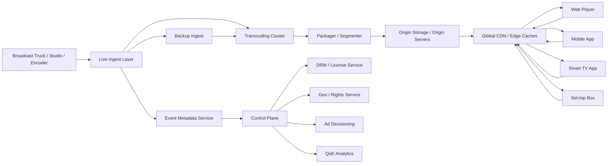

## Why this architecture works

* The **ingest layer** brings in the live feed reliably.
* The **transcoding layer** creates multiple quality levels for adaptive playback.
* The **packager** converts video into streamable chunks and manifests.
* The **origin** stores media segments before they fan out.
* The **CDN** handles the massive global delivery load.
* The **control plane** manages rights, DRM, and session authorization.

---

# 6. Video Delivery Fundamentals

Before designing components, it helps to understand how live video is delivered.

## Live video is not sent as one giant file

A live stream is broken into:

* short media segments
* manifests or playlists
* multiple bitrate renditions

The player repeatedly requests the next chunk.
If the network is fast, the player chooses higher quality.
If the network is unstable, it switches to a lower bitrate.

That is **adaptive bitrate streaming**.

---

## Common streaming protocols

| Protocol          | Use                                          |
| ----------------- | -------------------------------------------- |
| HLS               | Common for Apple and many web/mobile players |
| MPEG-DASH         | Common adaptive streaming standard           |
| CMAF              | Low-latency and shared packaging format      |
| WebRTC            | Ultra-low-latency use cases                  |
| RTMP / SRT / RIST | Ingest transport from encoders               |

### Practical reality

A live sports platform often uses:

* RTMP, SRT, or RIST for ingest
* HLS or DASH for delivery
* CMAF for low-latency packaging when latency matters more

---

# 7. Ingest Architecture

The ingest layer receives live video from:

* stadium encoders
* remote production units
* broadcaster studios
* backup feeds
* multilingual commentary feeds
* auxiliary camera angles

## Ingest goals

* accept video reliably
* support redundant feeds
* detect stream health
* minimize startup time
* fail over to backup ingest path when needed

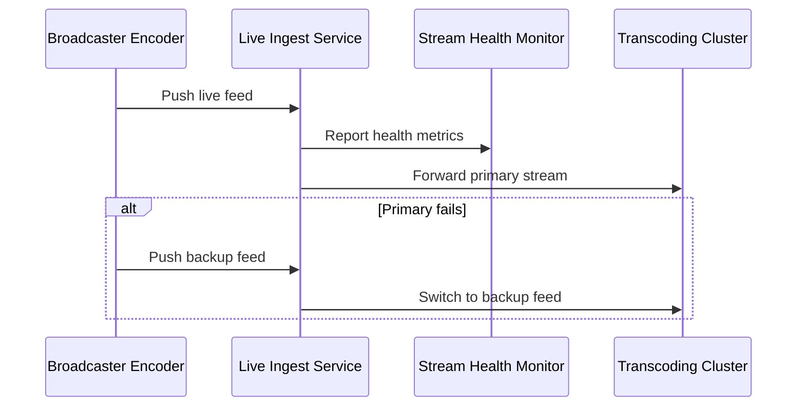

## Why redundant ingest matters

If a camera truck loses connectivity, the stream cannot depend on a single network path.

A real sports platform should support:

* primary ingest
* backup ingest
* automatic failover
* stream health alarms
* continuous monitoring of frame rate, packet loss, and segment generation

---

# 8. Transcoding and Encoding

The ingest feed is usually a single high-quality stream.
But viewers have different devices and network conditions.

So the platform must generate many renditions:

* 240p low bitrate
* 360p
* 480p
* 720p
* 1080p
* 4K for supported clients

## Why transcoding is necessary

A phone on a weak mobile connection cannot reliably play a 4K stream.
A smart TV on fiber can.

Adaptive bitrate streaming lets the player choose the best stream dynamically.

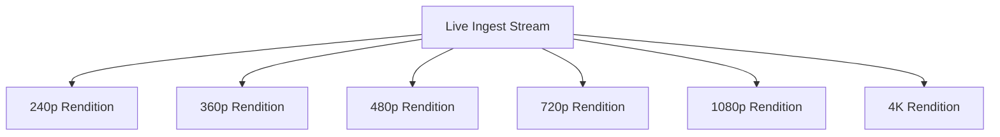

## Transcoding tradeoffs

### Cloud transcoding

Pros:

* elastic
* easy to scale per event

Cons:

* expensive at very large scale
* can add latency

### On-prem or edge encoding

Pros:

* better control
* often lower long-term cost for very large volume

Cons:

* more operational complexity

### Practical design

Many large platforms use a hybrid setup:

* central cloud or regional encoding
* edge assist for distribution
* special handling for marquee events

---

# 9. Packaging and Segmenting

Once video is transcoded, it is packaged into segments and manifests.

## What packaging does

The packager:

* cuts video into small chunks
* creates playlists/manifests
* aligns audio and subtitle tracks
* supports multiple renditions
* prepares low-latency delivery formats

## Segment size matters

Smaller segments reduce latency but increase overhead.

Typical tradeoff:

* longer segments: less overhead, more latency
* shorter segments: lower latency, more requests, more load

For sports, low latency is often worth the extra complexity.

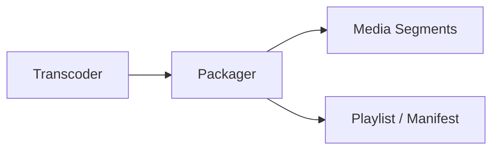

---

# 10. Low-Latency Streaming

Sports streaming often needs lower latency than regular video-on-demand.

Why:

* live commentary matters
* score updates should be timely
* viewers compare timing across platforms
* social media spoilers are a concern

## Approaches to lower latency

* shorter segments
* chunked transfer
* CMAF low-latency modes
* smaller player buffer
* optimized CDN and origin paths
* avoiding long buffering delays in the player

### Tradeoff

The lower the latency, the less buffer the player has to survive network instability.

So low latency improves freshness but can worsen playback stability if not tuned carefully.

A good system provides:

* standard latency mode for stability
* low-latency mode for high-value sports content

---

# 11. Origin and Object Storage

The origin is the source from which CDNs pull video segments.

## Origin responsibilities

* serve manifests and segments
* maintain recently generated live content
* survive temporary CDN cache misses
* store replayable archive copies
* provide fallback if edge caches are cold

## Object storage

For archived content and stored segments, object storage is a cost-effective and durable choice.

Typical data:

* media segments
* manifests
* thumbnails
* highlights
* subtitles
* alternate audio tracks
* event recordings

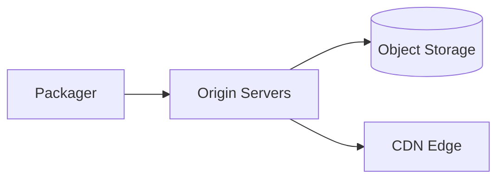

---

# 12. CDN Architecture

The CDN is one of the most important parts of the design.

Without CDN, the origin would need to serve millions of viewers directly, which is not practical.

## CDN responsibilities

* cache video segments near viewers
* reduce origin load
* improve startup time
* improve reliability
* absorb traffic spikes
* deliver content globally

## Why CDN is essential for sports

A goal, wicket, touchdown, or finish line can trigger huge synchronized traffic.

The CDN must be able to:

* fan out content worldwide
* handle sudden traffic spikes
* provide regional resilience
* support edge cache hit ratios high enough to keep origin safe

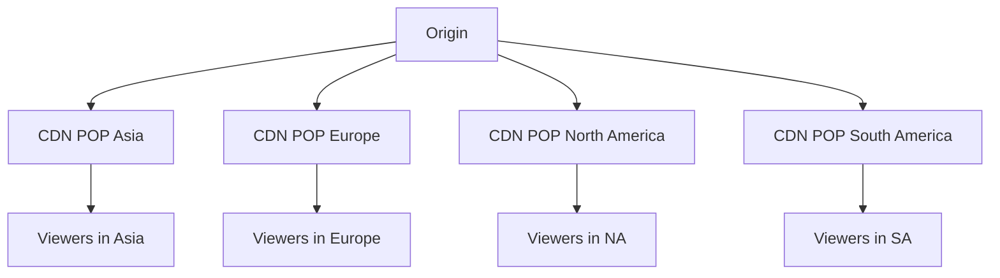

---

# 13. Playback on Different Devices

A real sports streaming service must support many playback environments:

* web browsers
* iOS and Android apps
* smart TVs
* streaming sticks
* gaming consoles
* set-top boxes

Each environment has different:

* codec support
* DRM support
* network behavior
* UI constraints
* buffering limits
* audio/subtitle features

## Device capability detection

The player should detect:

* supported codecs
* display resolution
* network speed
* DRM capability
* platform-specific restrictions

Then it chooses the best stream variant.

## Why device diversity is hard

A stream that plays well on a browser might not work on an older TV platform.
So the platform must deliver:

* multiple codecs if needed
* multiple DRM schemes if needed
* device-specific player logic

---

# 14. Adaptive Bitrate Playback

ABR is the heart of user experience.

The player constantly measures:

* download speed
* buffer depth
* dropped frames
* decode performance
* latency

Then it switches between renditions.

## Why ABR matters

If network speed falls, the player should lower quality before it starts stuttering.
If network speed improves, it should ramp up quality gradually.

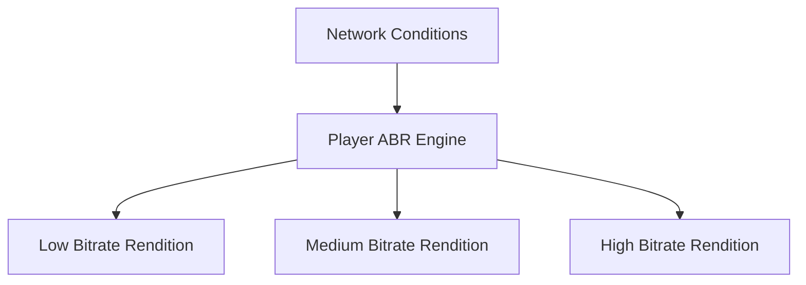

### Goal

Deliver the highest possible quality without causing rebuffering.

---

# 15. DRM and Content Protection

Sports content is valuable and often tightly licensed.

The platform must protect it from unauthorized access.

## DRM responsibilities

* issue license tokens
* enforce device-specific playback rights
* prevent direct file access where possible
* expire access after session end
* enforce region and subscription rules

### Common DRM patterns

Different device ecosystems often require different DRM systems.

The platform should abstract license acquisition behind a unified service.

## Why DRM is necessary

Live sports rights are expensive.
Unauthorized redistribution directly harms business and licensing agreements.

---

# 16. Geo-Restriction and Rights Management

Sports rights are often sold by geography.

A stream may be:

* available in one country
* blacked out in another
* accessible only to specific subscription tiers
* restricted by time window or event type

## Geo-rights system

The backend must verify:

* user region
* IP geolocation
* account region
* rights contract for the event
* local blackout rules

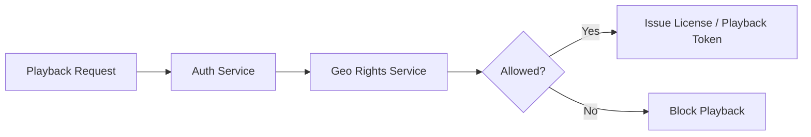

### Important

Geo enforcement should happen at both:

* playback authorization time
* license issuance time

That gives defense in depth.

---

# 17. Live Event Metadata

A sports stream is more than video.

It also carries:

* score overlays
* player stats
* timer/clock data
* substitutions
* commentary labels
* event markers
* key moments
* camera angle labels

## Metadata architecture

A separate metadata service can ingest live event updates and deliver them to clients alongside video.

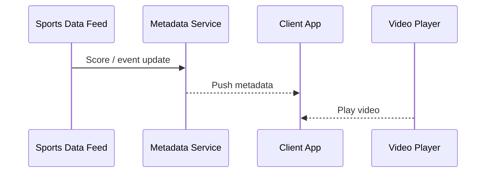

This lets the UI update scores and graphics without interrupting the stream.

---

# 18. Ads and Monetization

A large live streaming platform often monetizes with ads or subscriptions.

## Ad types

* pre-roll
* mid-roll
* post-roll
* sponsor overlays
* regional ad insertion

### Server-side ad insertion

For live sports, server-side ad insertion is often preferred because it is harder to block and looks seamless.

The ad system needs:

* ad decisioning
* ad stitching
* targeting
* measurement
* fallback ads
* frequency capping

---

# 19. Subtitles and Audio Tracks

Sports audiences are global.

The platform may need:

* multiple commentary languages
* closed captions
* accessibility subtitles
* alternate audio feeds

## Why this matters

It increases accessibility and expands audience reach.

The packager should keep these tracks synchronized with the video timeline so users can switch without drift.

---

# 20. Session Management and Playback Tokens

A playback request should not be anonymous and uncontrolled.

The service should issue:

* playback session tokens
* entitlement checks
* time-limited access
* DRM license links
* region-specific authorization

This prevents direct hotlinking and unauthorized redistribution.

---

# 21. Reliability and Resilience

Sports streaming must survive failures gracefully.

## Failure scenarios

* primary ingest fails
* transcode node crashes
* CDN POP misbehaves
* origin latency increases
* region outage occurs
* license server fails
* metadata feed lags
* ad decisioning times out

## Resilience patterns

* redundant ingest
* redundant encoders
* multi-region origin replication
* CDN failover
* circuit breakers
* retry with backoff
* graceful degradation
* fallback to lower quality or backup stream

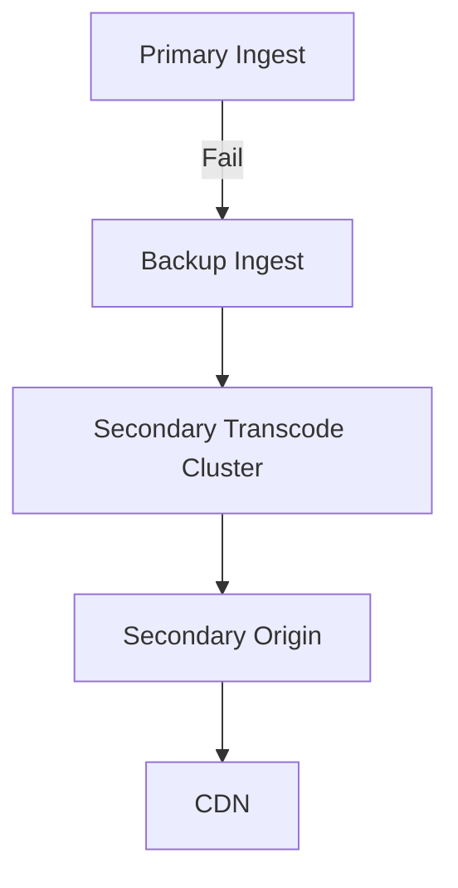

### Degraded mode examples

If metadata fails:

* video can still continue without overlay updates

If ads fail:

* fallback to filler content or no-ad playback

If low-latency mode fails:

* switch to standard HLS mode

The priority is to keep the live event playing.

---

# 22. Multi-Region Architecture

A global live streaming service should not depend on one region.

## Goals

* serve users near their geographic location
* reduce latency
* survive regional failure
* replicate control plane data
* support global traffic spikes

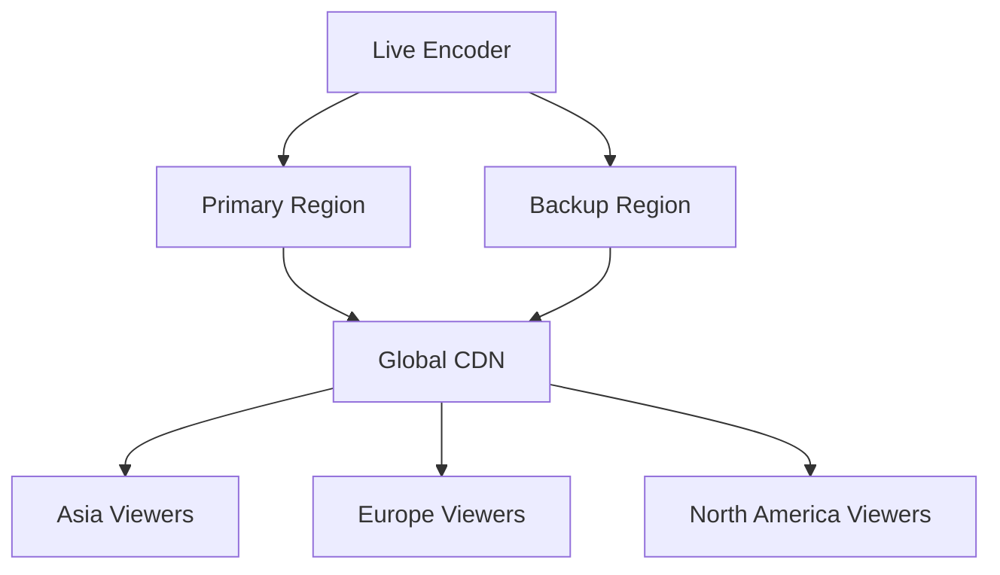

## Practical approach

* one region may own live event control
* multiple regions may host cached origin copies
* CDNs pull from the nearest healthy origin
* viewer traffic is always delivered from the closest edge possible

---

# 23. Control Plane vs Data Plane

This distinction is very important.

## Control plane

Handles:

* event setup
* rights
* DRM policies
* stream metadata
* ads configuration
* playback tokens
* analytics configuration

## Data plane

Handles:

* ingest
* transcoding
* segment delivery
* playback traffic
* CDN fanout

Keeping these separate makes the system easier to scale and secure.

---

# 24. Observability

A live streaming platform must be deeply observable.

## Critical metrics

| Metric                       | Why it matters                     |
| ---------------------------- | ---------------------------------- |
| Ingest health                | Confirms source feed stability     |
| Transcode latency            | Measures pipeline delay            |
| Segment generation delay     | Impacts live freshness             |
| CDN cache hit ratio          | Impacts bandwidth cost and latency |
| Playback startup time        | User experience                    |
| Rebuffer rate                | Playback quality                   |
| Bitrate switch frequency     | Network stability                  |
| End-to-end latency           | Live sports freshness              |
| DRM license errors           | Access issues                      |
| Region-specific failure rate | Geo resilience                     |

## Client QoE telemetry

The player should report:

* time to first frame
* stall count
* total rebuffer duration
* resolution selected
* error codes
* latency behind live edge

This data is essential to debugging playback quality problems in the real world.

---

# 25. Data Flows

## Main live flow

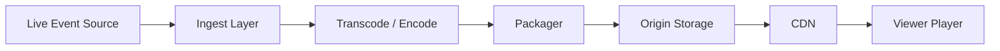

## Metadata flow


## Analytics flow


---

# 26. Search and Discovery

A streaming platform also needs discovery:

* live event schedules
* upcoming matches
* featured games
* highlights
* replays
* team pages
* league pages

Search and browse can be backed by:

* search index
* content catalog
* recommendation system

This is separate from the streaming data plane but vital for engagement.

---

# 27. Highlights and Replay Clips

Sports viewers often want:

* key plays
* goal clips
* wicket clips
* replays
* highlights after the match

A clip generation pipeline can:

* detect key moments from metadata
* generate short clips
* store them in object storage
* serve them through the same CDN

This creates a second content layer beyond the live stream.

---

# 28. Caching Strategy

Caching is essential, but must be done carefully.

## Cache what helps

* manifests near the edge
* short media segments
* event metadata
* auth results
* device capability decisions
* rights checks where safe

## Do not cache blindly

* expired playback tokens
* rights-sensitive authorization results without TTL rules
* live control plane decisions beyond their valid window

The edge cache should prioritize freshness for live manifests while maximizing segment reuse.

---

# 29. Rate Limiting and Abuse Protection

Live sports attracts abuse:

* credential stuffing
* account sharing
* scraping of live metadata
* token replay
* hotlinking
* piracy attempts

## Protections

* per-account session limits
* IP/device reputation
* signed URLs
* short-lived playback tokens
* license request throttling
* anomaly detection

---

# 30. Security Architecture

## Security requirements

* HTTPS everywhere
* DRM license protection
* signed manifests and tokens
* service-to-service authentication
* least privilege access
* secret management
* audit logs for control actions
* watermarking where relevant
* anti-piracy detection systems

### Why security matters

A live sports stream is a high-value target for illegal restreaming.
Protecting it is part of the business model.

---

# 31. Cost Optimization

Streaming is expensive at scale, especially due to bandwidth.

## Major cost drivers

* CDN egress
* transcoding compute
* storage for recorded content
* global redundancy
* telemetry ingestion

## Cost optimization techniques

* aggressive CDN cache hit optimization
* right-sized ABR ladder
* only encode necessary renditions
* use lower latency modes only where needed
* archive old content to cheaper storage
* prefetch only popular live events
* regionalize traffic to reduce long-haul delivery

A platform with poor bitrate design can waste an enormous amount of bandwidth.

---

# 32. Disaster Recovery

Sports events are time-sensitive.
There is no second chance for a live broadcast.

## DR goals

* fail over ingest in seconds
* switch to backup origin if needed
* preserve playback tokens and rights metadata
* restore event config from replicated control plane
* maintain multi-region backups of metadata and recording

## What must be recoverable

* stream configuration
* rights configuration
* playback auth
* metadata timelines
* archived recordings
* telemetry
* ad configs

---

# 33. Example Playback Lifecycle

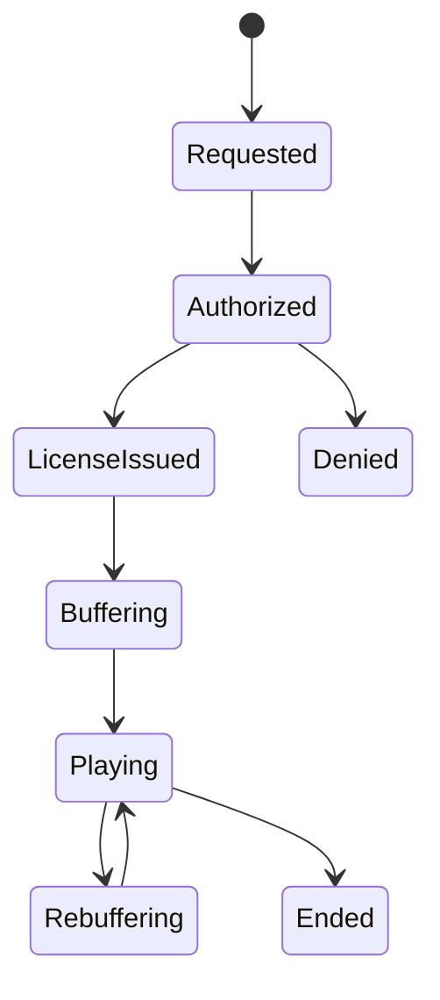

This helps formalize the user playback journey.

---

# 34. Bottlenecks and Solutions

| Bottleneck           | Cause                                 | Solution                                             |
| -------------------- | ------------------------------------- | ---------------------------------------------------- |
| CDN miss storm       | Large event starts                    | Prefetch popular manifests and prime caches          |
| Transcoding overload | Many renditions per stream            | Autoscale encode clusters and prioritize top events  |
| Ingest failure       | Encoder/network issues                | Redundant ingest and automatic failover              |
| DRM bottleneck       | License service hot spot              | Regional license servers + caching where appropriate |
| Latency spikes       | Bad segment duration or network delay | Tune chunk size and low-latency mode                 |
| Viewership spike     | Championship moments                  | CDN elasticity and origin shielding                  |

---

# 35. Final Architecture Diagram

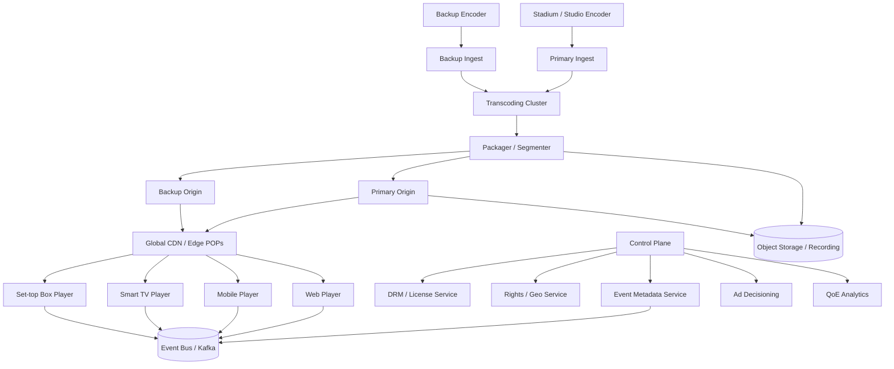

---

# 36. Conclusion

A live sports streaming service is one of the most demanding consumer-scale distributed systems you can design.

It must provide:

* reliable ingest from the stadium or studio
* real-time transcode and packaging
* adaptive playback across many devices
* CDN-backed global fan-out
* low latency for sports freshness
* DRM and rights enforcement
* geo-aware access control
* resilience to region and provider failures
* observability down to player quality-of-experience
* cost control at extreme bandwidth scale

The central design principles are:

* **separate ingest, encode, package, and delivery**
* **use CDN for global scale**
* **support adaptive bitrate streaming**
* **build for redundancy from ingest to playback**
* **keep the control plane separate from the media plane**
* **use DRM and rights enforcement everywhere they matter**
* **instrument player QoE heavily**
* **design for failure, because live events cannot be replayed**

A good live streaming service makes the viewer experience feel simple and stable.

A great one survives the entire world trying to watch the same moment at the same time.

If you want, I can turn this into an even deeper version with separate deep dives on **HLS vs DASH vs CMAF**, **low-latency streaming**, **CDN design**, **DRM architectures**, and **multi-region failover for live sports**.
