# Design a Live Streaming Service

Designing a live sports streaming platform is much harder than designing regular video-on-demand.

With VOD, the content already exists.

With live streaming, everything happens in real time:

* cameras capture the event
* the broadcast feed is encoded
* segments are packaged
* the stream is pushed globally
* millions of users watch simultaneously
* the system must remain synchronized
* failure tolerance must be extremely high
* latency must remain low enough to feel live

For sports, latency matters because fans want to see the action nearly as it happens. Low-latency delivery standards exist precisely for this use case. Apple’s HLS documentation says HLS is designed for reliability and adapts to network conditions, while Low-Latency HLS extends HLS to reduce latency while maintaining scalability. DASH-IF similarly documents low-latency DASH for live services that need consistent end-to-end delay. SRT is also explicitly positioned as a secure, low-latency transport for unreliable networks, with packet-loss recovery, jitter control, and encryption. ([Apple Developer][1])

A real system for a globally televised sports match therefore needs three things at the same time:

1. ultra-reliable ingest from the stadium,
2. scalable transcoding and packaging,
3. global low-latency distribution through edge networks.

AWS’s live streaming documentation is a good reference architecture because it combines input redundancy, transcoding, packaging, and Amazon CloudFront for global delivery, and it supports HLS, DASH, and CMAF outputs. ([Amazon Web Services, Inc.][2])

---

# 1. Problem Statement

Design a live streaming platform for a major sports match that can:

* ingest live video from the stadium
* process multiple camera feeds
* package and deliver the final live stream globally
* support millions of concurrent viewers
* maintain low latency
* survive encoder failures and network interruptions
* support DVR rewind for a live match
* show live scores and overlays
* support adaptive bitrate playback
* support geo-restrictions and rights management
* support real-time chat and reactions
* collect analytics for operators and broadcasters

---

# 2. Functional Requirements

| Requirement          | Description                                                  |
| -------------------- | ------------------------------------------------------------ |
| Live Ingest          | Receive live broadcast feed from stadium or production truck |
| Adaptive Playback    | Viewers receive the best quality based on bandwidth          |
| Global Delivery      | Users watch from different regions with low latency          |
| Low-Latency Mode     | Keep live delay small enough for sports                      |
| DVR                  | Allow rewind during the live event                           |
| Multi-Device Support | TV, web, mobile, tablet, smart devices                       |
| Authentication       | Secure access to the broadcast                               |
| Geo Restriction      | Restrict content by region or rights                         |
| Live Score Overlay   | Show match score and updates in real time                    |
| Chat / Reactions     | Optional live engagement layer                               |
| Analytics            | Track watch time, buffering, churn, and engagement           |
| Ad Insertion         | Support live ad markers or server-side ad insertion          |
| Failover             | Continue even if an ingest path fails                        |

---

# 3. Non-Functional Requirements

| Requirement     | Goal                                                      |
| --------------- | --------------------------------------------------------- |
| Availability    | Broadcast should not go offline during the match          |
| Scalability     | Serve millions or tens of millions of concurrent viewers  |
| Latency         | Keep playback delay low                                   |
| Reliability     | Handle feed loss, encoder failures, and network jitter    |
| Durability      | Preserve event recording and playback history             |
| Consistency     | Ensure the live timeline remains coherent                 |
| Global Reach    | Users across continents should receive fast playback      |
| Security        | Protect broadcast rights and tokens                       |
| Observability   | Monitor ingest, encoding, delivery, and viewer experience |
| Cost Efficiency | Use CDN/edge caching to reduce origin load                |

---

# 4. Capacity Estimation

Assume a major global sports event:

* 20 million concurrent viewers at peak
* average bitrate 4 Mbps per viewer
* multiple quality ladders
* global CDN fanout
* 2 ingest paths from stadium
* one primary and one backup encoder path
* millions of playback manifest requests per minute

Peak bandwidth estimate:

```text
20,000,000 viewers × 4 Mbps = 80,000,000 Mbps
= 80 Tbps
```

This makes one thing clear:

```text
The origin cannot serve viewers directly.
```

The system must rely on:

* CDN edge caches
* regional distribution
* proactive content placement
* chunk reuse
* adaptive bitrate streaming

---

# 5. High-Level Architecture

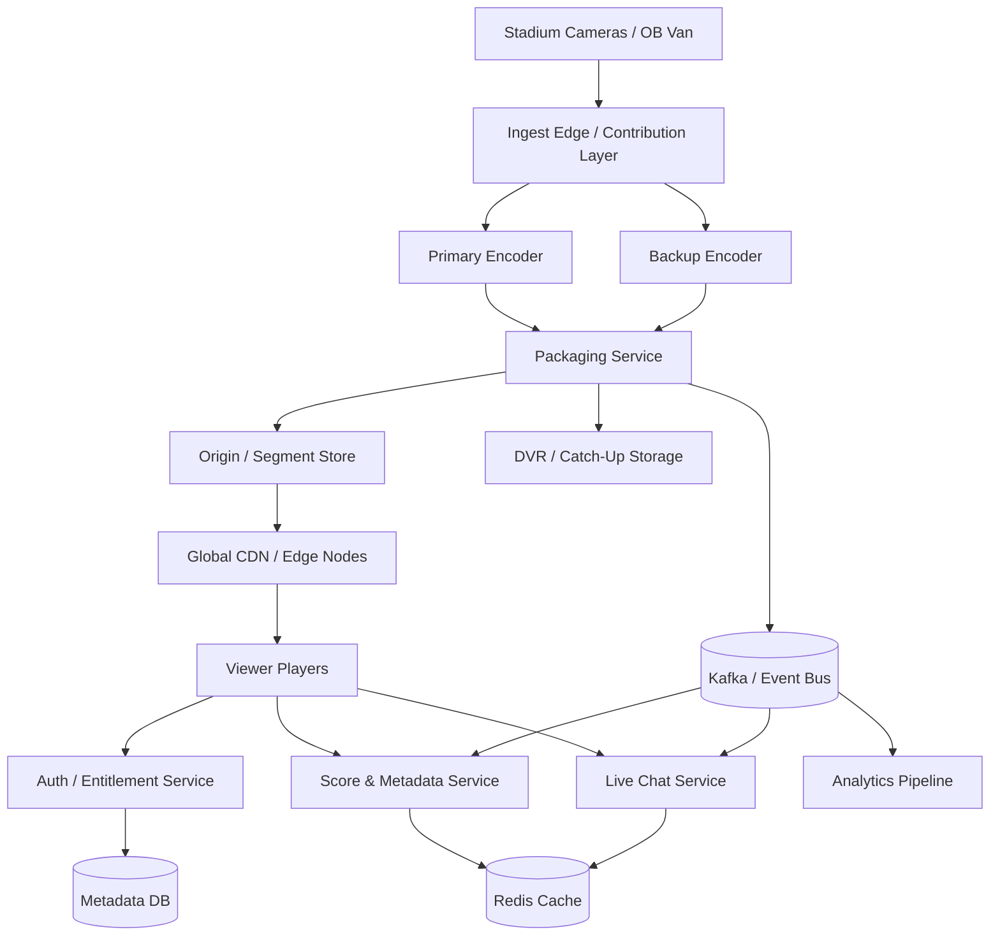

This architecture separates:

* contribution ingest
* processing
* storage
* global delivery
* interactive services
* analytics

---

# 6. End-to-End Live Streaming Flow

A live broadcast should move through the system like this:

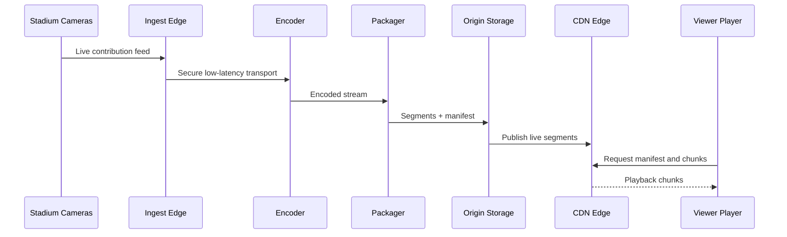

The major engineering trick is to keep this pipeline continuous and resilient while minimizing delay.

---

# 7. Stadium Ingest Layer

The ingest layer receives the feed from the stadium or outside broadcast truck.

This layer must be resilient because the last-mile network is often unpredictable. SRT is specifically described as secure, low-latency, and optimized for packet-loss recovery, jitter control, encryption, and resilience over unpredictable IP networks. That makes it a strong choice for contribution transport from the venue to the cloud or broadcast headend. ([SRT Alliance][3])

---

## Why SRT is a Good Fit

| Feature              | Why it matters                       |
| -------------------- | ------------------------------------ |
| Low latency          | Sports feeds must arrive quickly     |
| Packet-loss recovery | Stadium networks are not perfect     |
| Jitter control       | Smooth transport from venue to cloud |
| Encryption           | Secure contribution feed             |
| Resilience           | Handles unstable networks better     |

---

## Ingest Topology

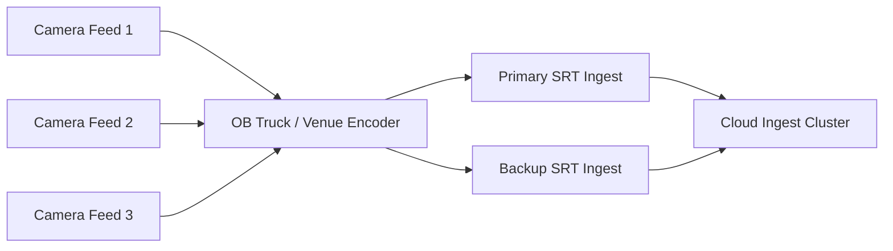

The ingest layer should be redundant from day one.

One ingest path is never enough for a global live event.

---

# 8. Encoder Strategy

The encoder converts raw live input into usable streaming formats.

It should produce:

* multiple bitrates
* multiple resolutions
* multiple codecs if needed
* thumbnails
* audio variants
* captions
* metadata markers

The live encoding layer should be horizontally scalable and ideally GPU-accelerated for high throughput.

---

## Encoding Ladder

A typical quality ladder might be:

| Resolution | Bitrate    |
| ---------- | ---------- |
| 240p       | 300 kbps   |
| 360p       | 700 kbps   |
| 480p       | 1.2 Mbps   |
| 720p       | 2.5 Mbps   |
| 1080p      | 5 Mbps     |
| 4K         | 10–15 Mbps |

The player chooses based on current bandwidth and device capability.

---

## Encoding Pipeline

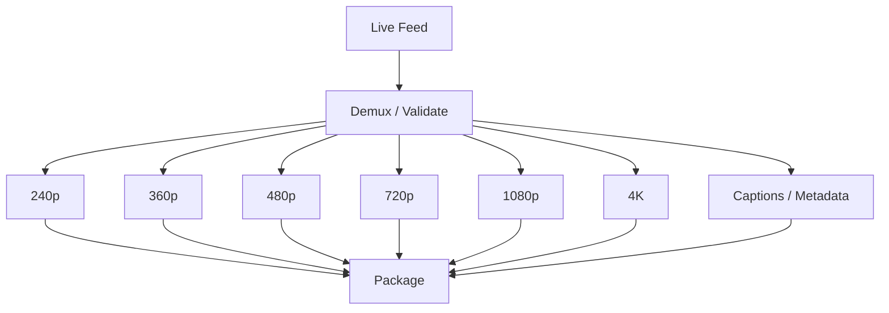

---

# 9. Packaging Layer

Packaging converts encoded output into streaming formats for viewers.

For global compatibility, a live sports service should support:

* HLS
* Low-Latency HLS
* MPEG-DASH
* CMAF chunks where possible

Apple’s HLS documentation says HLS is designed for reliability and works with ordinary web servers and CDNs, and its low-latency extension reduces latency while maintaining scalability. DASH-IF similarly documents low-latency DASH for live services needing consistent low delay. AWS’s live streaming solution also explicitly supports HLS, DASH, and CMAF for playback support across devices. ([Apple Developer][1])

---

## Why Use Both HLS and DASH

| Format           | Strength                                              |
| ---------------- | ----------------------------------------------------- |
| HLS              | Broad support, especially on Apple ecosystems         |
| LL-HLS           | Lower latency while keeping scalability               |
| DASH             | Strong support for adaptive streaming in many players |
| Low-Latency DASH | Useful for low-delay live services                    |

A real global system often outputs multiple playback formats to support the widest device matrix.

---

# 10. Origin and Storage Strategy

The origin should not be a single server.

It should be a redundant origin cluster backed by object storage or segment storage.

AWS’s live streaming guidance notes that live workflows can combine MediaLive, MediaPackage, and CloudFront and supports highly available live video delivery globally. It also documents input redundancy and multiple output formats. ([Amazon Web Services, Inc.][2])

---

## Origin Responsibilities

| Responsibility      | Description                       |
| ------------------- | --------------------------------- |
| Store live segments | Keep current stream chunks        |
| Publish manifests   | Provide latest playlist           |
| Support DVR windows | Keep enough historical segments   |
| Serve as CDN origin | Feed edge cache on misses         |
| Handle failover     | Continue when upstream paths fail |

---

# 11. CDN Architecture

The CDN is the key to global scale.

The origin cannot serve every viewer directly because the bandwidth requirement is enormous.

Instead, segments are pushed or pulled to edge nodes close to viewers.

AWS explicitly describes CloudFront as part of its live streaming solution for delivering live content worldwide, and Apple states HLS works with ordinary web servers and CDNs. Open Connect documentation from Netflix uses the same broad principle: put content close to users and localize traffic near the edge. ([Amazon Web Services, Inc.][2])

---

## CDN Flow

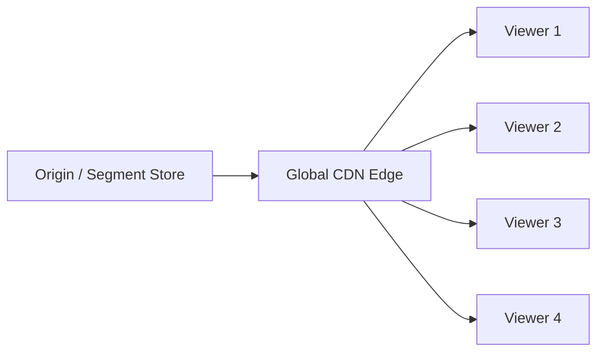

---

## Why CDN Is Essential

| Benefit             | Explanation                     |
| ------------------- | ------------------------------- |
| Latency reduction   | Edge nodes are near users       |
| Bandwidth offload   | Origin is protected             |
| Global scalability  | Millions of users can be served |
| Regional resiliency | Traffic shifts to nearby nodes  |
| Better UX           | Faster startup and fewer stalls |

---

# 12. Low-Latency Strategy

Sports viewers care deeply about delay.

If the stream is too far behind live, the audience experiences spoilers from social media, chat, or notifications.

The design should target low latency, but not at the cost of instability.

Apple’s LL-HLS documentation and DASH-IF’s low-latency docs both emphasize low delay while preserving scalable playback behavior. ([Apple Developer][4])

---

## Latency Targets

A realistic global live sports system might target:

| Mode              | Approximate Target          |
| ----------------- | --------------------------- |
| Standard live     | 15–30 seconds               |
| Low-latency live  | 3–8 seconds                 |
| Ultra-low latency | 1–3 seconds, with tradeoffs |

The lower the latency, the harder it becomes to preserve stability at scale.

---

# 13. Playback Flow

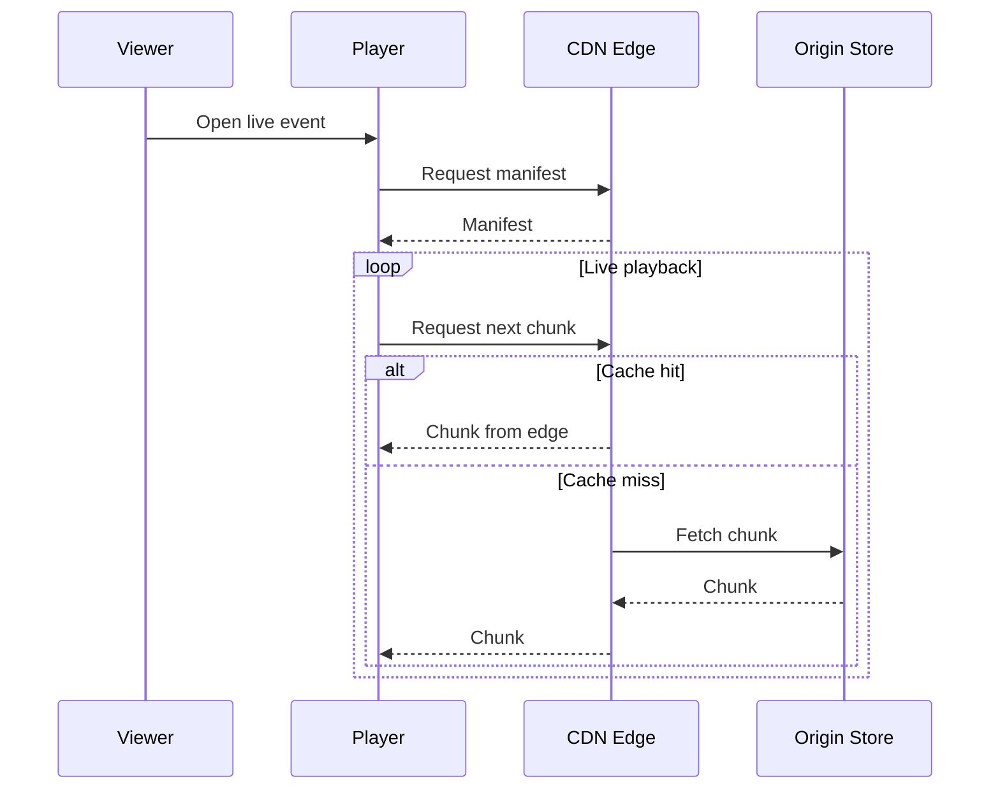

The player must support adaptive bitrate switching to adjust dynamically as network conditions change.

---

# 14. DVR and Catch-Up TV

A sports live platform should allow viewers to rewind during the match.

This requires a DVR window.

The platform keeps a rolling buffer of live segments, typically for:

* 30 minutes
* 1 hour
* the whole event

depending on business needs.

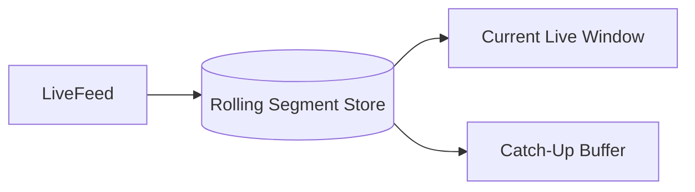

---

# 15. Live Metadata and Score Overlay

Sports streaming is not just video.

It also includes:

* score updates
* player stats
* match clock
* foul counts
* commentary markers
* event markers

These are better handled as separate real-time metadata streams.

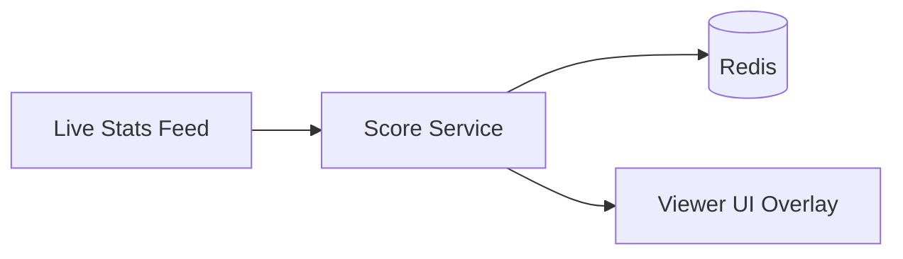

This allows the video and score layers to be updated independently.

---

# 16. Chat and Reactions

For large-scale live sports events, viewers often want chat and reactions.

These should be asynchronous and heavily rate-limited.

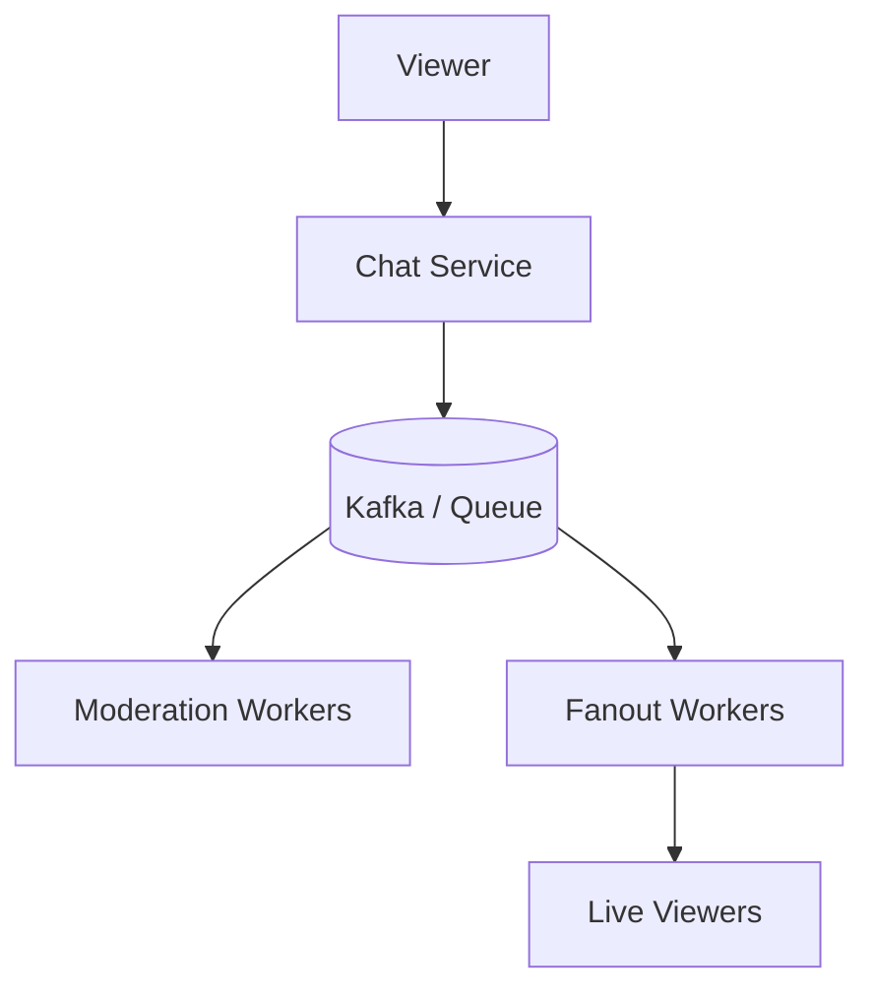

Chat is highly bursty and must be isolated from playback so that chat load cannot break the stream.

---

# 17. Notification System

Notifications help users discover live events and match milestones.

Examples:

* match started
* goal scored
* halftime
* final whistle
* exclusive replay available

This should be driven by event streams rather than synchronous calls.

---

# 18. Event-Driven Backbone

A live sports platform is naturally event-driven.

Events might include:

* IngestStarted
* SegmentPublished
* BitrateSelected
* ViewerJoined
* BufferUnderrun
* GoalScored
* MatchEnded
* ChatMessagePosted
* StreamFailureDetected

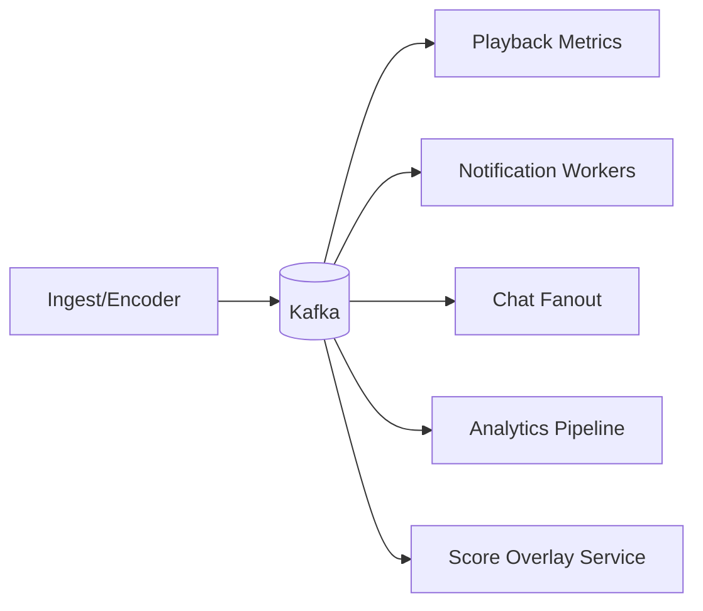

This allows the platform to scale processing independently from the live playback path.

---

# 19. Authentication and Access Control

A real sports telecast may require:

* subscription checks
* region restrictions
* device restrictions
* entitlement validation
* account concurrency limits

The edge layer should validate:

* token
* subscription
* geo policy
* device policy

before granting playback access.

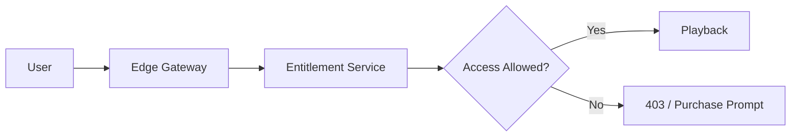

---

# 20. Geo-Restriction and Rights Management

Sports rights are often region-specific.

The system should support:

* country-based restrictions
* blackout windows
* broadcaster-specific rights
* subscription-based access
* VPN detection signals where required by policy

This logic belongs in the entitlement layer, not in the player.

---

# 21. Data Model

The system needs distinct data models for user, event, stream, and playback state.

---

## Core Entities

| Entity          | Purpose                  |
| --------------- | ------------------------ |
| User            | Account and identity     |
| Subscription    | Access entitlement       |
| Event           | Sports match             |
| Stream          | Live feed metadata       |
| Segment         | Video chunk metadata     |
| PlaybackSession | Viewer session           |
| DVRWindow       | Catch-up buffer metadata |
| ScoreEvent      | Live game events         |
| ChatMessage     | Interactive chat         |
| ViewingHistory  | Playback analytics       |
| Notification    | Alert delivery record    |

---

## ER Diagram

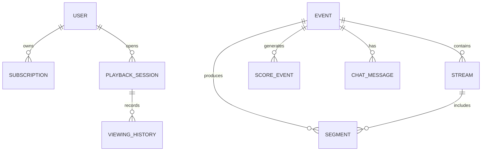

---

# 22. Storage Strategy

Different data requires different storage systems.

| Data             | Recommended Storage      |
| ---------------- | ------------------------ |
| User accounts    | SQL                      |
| Entitlements     | SQL                      |
| Match metadata   | SQL or distributed NoSQL |
| Live segments    | Object storage + CDN     |
| Score events     | Redis + durable DB       |
| Chat messages    | Kafka + NoSQL            |
| Playback history | NoSQL / warehouse        |
| Analytics        | Data lake / warehouse    |

---

# 23. Multi-Region Strategy

A global live sports event should never depend on a single region.

Use:

* regional ingest failover
* replicated metadata
* regional CDN placement
* active-active read delivery
* backup origins

AWS’s public live streaming solution materials emphasize highly available delivery using Media Services and CloudFront, which aligns well with an active-active, globally distributed model. ([AWS Documentation][5])

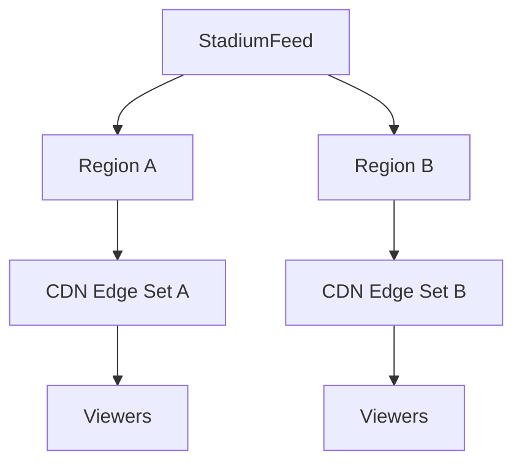

---

# 24. Ingest Redundancy

Live ingest should be redundant from the first mile.

Use:

* two encoders
* two ingest paths
* separate network providers
* automatic failover
* health monitoring

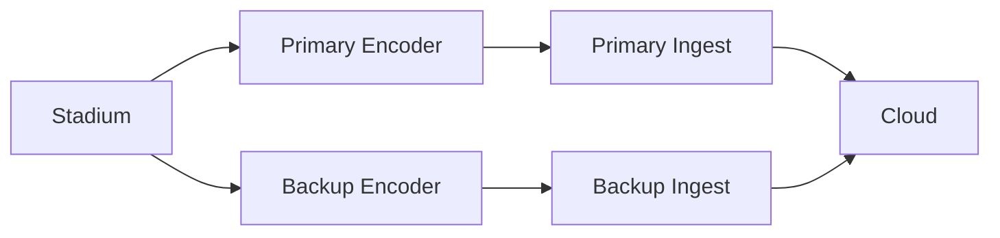

If one feed fails, the second takes over.

---

# 25. Failover Behavior

During a live sports event, the platform must fail gracefully.

Possible failure modes:

* encoder failure
* ingest network outage
* packaging service crash
* CDN node failure
* origin storage issue
* metadata service failure

Graceful fallback strategies include:

* redundant ingest
* origin replication
* retry with backoff
* alternate CDN route
* cached backup manifests
* degradation to slightly higher latency rather than a stream outage

---

# 26. Packet Loss and Jitter Handling

Contribution links from venue to cloud are often unstable.

SRT is useful here because its official documentation emphasizes secure low-latency streaming, jitter control, and packet-loss recovery over unpredictable networks. ([SRT Alliance][3])

That makes it a good choice for:

* stadium uplink
* remote broadcasting
* backup contribution
* disaster recovery ingest

---

# 27. Viewership Spike Handling

A live sports final can produce sudden traffic spikes.

The platform must handle:

* viewers joining at kickoff
* halftime spikes
* goal-scoring spikes
* social-media-driven traffic surges
* post-match replay surges

Mitigations:

* CDN edge caching
* pre-warmed manifests
* regional edge distribution
* autoscaled control-plane services
* stateless playback servers
* queue-based event processing

---

# 28. Scaling the Playback Plane

The playback plane should be largely stateless.

That means:

* no sticky sessions for playback itself
* load balancers distribute requests
* CDN handles most segment traffic
* playback services only issue manifests and entitlements

This is what lets the system scale to millions of viewers.

---

# 29. Scaling the Control Plane

The control plane includes:

* auth
* entitlement
* metadata
* score service
* notification service
* analytics ingestion
* recommendation overlays

These can be horizontally scaled using:

* stateless services
* cache
* queues
* read replicas
* sharded databases

---

# 30. Analytics and QoE

For live sports, operational visibility matters.

Track:

* startup time
* rebuffer ratio
* bitrate switches
* stream join failures
* CDN hit ratio
* region-level latency
* encoder health
* dropped segments

These metrics feed the observability stack and quality-of-experience dashboards.

---

# 31. Observability Architecture

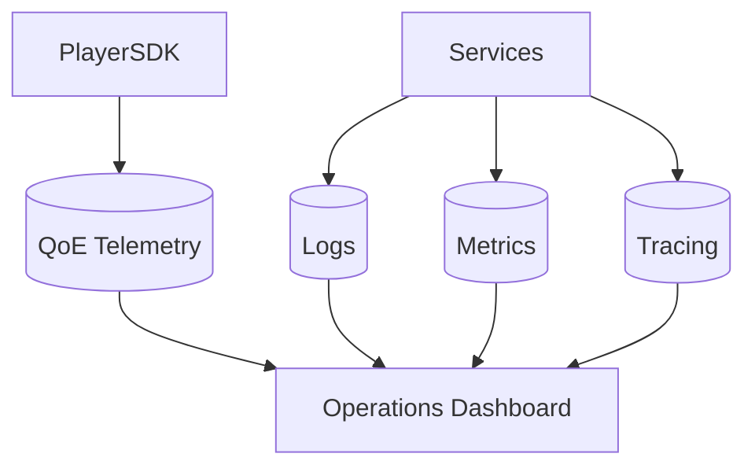

You cannot run a live broadcast platform safely without strong observability.

---

# 32. Security Architecture

The platform should use:

* TLS everywhere
* signed playback manifests
* signed segment URLs
* entitlement checks
* DRM for protected content
* short-lived tokens
* secure key management
* abuse controls
* audit logs

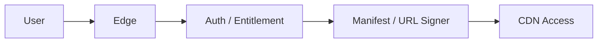

---

# 33. Ad Insertion

Sports streaming often relies on ad monetization.

Support:

* pre-roll
* mid-roll
* live ad markers
* server-side ad insertion
* regional ad targeting

Ad insertion should be built as a separate pipeline so it does not destabilize playback.

---

# 34. Player Responsibilities

The player is not just a video renderer.

It must:

* request the manifest
* maintain buffer health
* choose bitrate intelligently
* recover from stalls
* display score overlays
* handle chat widgets
* resume playback
* keep latency within target bounds

---

# 35. Player Playback Flow

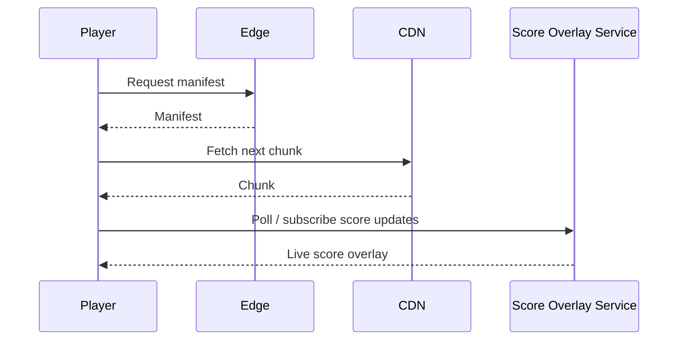

---

# 36. Choosing the Streaming Format

For a global sports service, a practical approach is:

| Format           | Why                                     |
| ---------------- | --------------------------------------- |
| HLS              | Broad device compatibility              |
| LL-HLS           | Lower-latency playback with scalability |
| DASH             | Strong adaptive streaming support       |
| Low-Latency DASH | Valuable for compatible players         |
| CMAF             | Common chunk format across protocols    |

Apple’s docs support HLS and low-latency HLS, and DASH-IF documents low-latency DASH. AWS’s live streaming solution supports HLS, DASH, and CMAF. ([Apple Developer][1])

---

# 37. Recommended Production Architecture

A real-world production design would look like this:

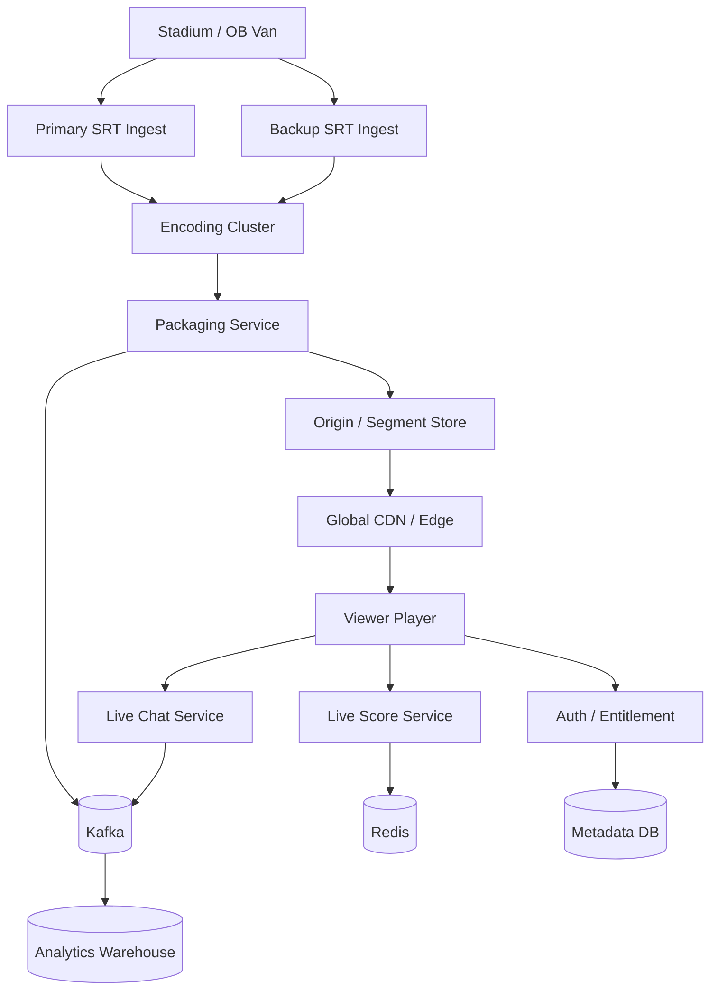

---

# 38. Why This Design Is Production Grade

This design works because it separates concerns cleanly:

| Concern                | How it is handled            |
| ---------------------- | ---------------------------- |
| Venue ingest           | Redundant SRT contribution   |
| Live encoding          | Scalable encoding cluster    |
| Protocol compatibility | HLS, LL-HLS, DASH, CMAF      |
| Global scale           | CDN / edge delivery          |
| Rights management      | Edge entitlement service     |
| Live interactivity     | Chat and score services      |
| Analytics              | Event-driven pipeline        |
| Reliability            | Redundant paths and failover |
| Low latency            | Edge-centric architecture    |

The AWS live streaming references describe a similar real-world production pattern: MediaLive for encoding, MediaPackage for packaging, CloudFront for global delivery, and redundancy for resilience. ([AWS Documentation][5])

---

# 39. Common Failure Scenarios and Fixes

| Failure                  | Fix                                 |
| ------------------------ | ----------------------------------- |
| Primary encoder dies     | Backup encoder takeover             |
| Stadium uplink drops     | Secondary contribution path         |
| CDN node overload        | Redirect to nearby edge             |
| Origin unavailable       | Replicated origin / origin failover |
| Chat service failure     | Playback continues independently    |
| Score feed delay         | Fall back to last known state       |
| Analytics lag            | Async processing and replay         |
| Entitlement service slow | Cache short-lived token claims      |

---

# 40. Design Tradeoffs

| Decision               | Tradeoff                                         |
| ---------------------- | ------------------------------------------------ |
| Low latency mode       | Less buffer, more sensitivity to jitter          |
| CDN-first architecture | More complexity in cache management              |
| Multi-format delivery  | Better compatibility, more processing            |
| Strong geo rights      | Better business control, more entitlement checks |
| Event-driven analytics | Great scale, delayed insights                    |
| Redundant ingest       | Higher cost, better availability                 |

---

# 41. What Not To Do

A live streaming service fails if it relies on:

* a single ingest path
* a single origin server
* synchronous transcoding
* direct-to-app-server video delivery
* no CDN
* no entitlement checks
* no buffering strategy
* no replay buffer
* no event pipeline
* no redundancy

That architecture will collapse under the first major sports event.

---

# 42. Final Answer Architecture

A real sports live telecast platform should be built like this:

1. capture live feed at the stadium
2. transport it securely and reliably with SRT or equivalent contribution links
3. encode it into multiple quality ladders
4. package it into HLS, LL-HLS, DASH, and CMAF-friendly outputs
5. store and distribute segments through a CDN or Open Connect-like edge network
6. use an entitlement service for access control and geo policy
7. keep playback state, chat, and scores separate from the media path
8. use Kafka for asynchronous fanout, analytics, and notifications
9. use Redis for hot ephemeral data like score state and live presence
10. use object storage and replicated origins for durable segment storage
11. deploy across multiple regions with failover
12. monitor everything with QoE metrics and operational dashboards

That is the shape of a real live streaming system that can handle a sports match being telecast globally.

---

# 43. Key Takeaways

| Concept       | Summary                                      |
| ------------- | -------------------------------------------- |
| Ingest        | Use redundant low-latency contribution links |
| Encoding      | Produce multiple bitrate ladders             |
| Packaging     | Support HLS, LL-HLS, DASH, CMAF              |
| Delivery      | Use CDN / edge distribution                  |
| Low Latency   | Optimize for sports-viewer expectations      |
| Interactivity | Separate chat and score overlays             |
| Reliability   | Duplicate every critical path                |
| Analytics     | Use async event pipelines                    |
| Security      | Entitlements, signed URLs, DRM               |
| Scale         | Stateless services and edge-first delivery   |

---

# Conclusion

A global live sports streaming system is a serious distributed-systems challenge.

The system must do all of the following at once:

* ingest live video reliably
* encode and package it quickly
* deliver it globally with low delay
* survive network and server failures
* support millions of viewers concurrently
* maintain correct playback state
* integrate score overlays, chat, and analytics
* respect rights and geo restrictions
* remain cost-efficient at huge scale

The right architecture is not a single server or a simple streaming endpoint.

It is a layered platform built around:

* redundant ingest
* asynchronous encoding
* adaptive streaming formats
* CDN edge delivery
* event-driven processing
* multi-region failover
* strong access control
* deep observability

That is how a real live sports broadcast becomes globally viewable, resilient, and low-latency at scale.

[1]: https://developer.apple.com/streaming/?utm_source=chatgpt.com "HTTP Live Streaming (HLS)"
[2]: https://aws.amazon.com/mediapackage/getting-started/?utm_source=chatgpt.com "Getting Started with AWS Elemental MediaPackage"
[3]: https://srtalliance.org/?utm_source=chatgpt.com "SRT Alliance - Secure, Low-Latency Video Streaming"
[4]: https://developer.apple.com/documentation/http-live-streaming/enabling-low-latency-http-live-streaming-hls?utm_source=chatgpt.com "Enabling Low-Latency HTTP Live Streaming (HLS)"
[5]: https://docs.aws.amazon.com/solutions/latest/live-streaming-on-aws/solution-overview.html?utm_source=chatgpt.com "Build highly available live video streaming content using ..."
