# Design a ChatGPT-Style Real-Time AI Chat System

A ChatGPT-style system looks simple from the user’s point of view.

A user types a prompt.
The model responds.
Tokens appear one by one in real time.

That simplicity hides one of the hardest production systems in modern software.

A real conversational AI platform must handle:

* millions of concurrent chats
* low-latency response streaming
* long context windows
* prompt ingestion and tokenization
* model routing across multiple model sizes
* retrieval over documents and web-like corpora
* tool calling and function execution
* memory and personalization
* moderation and safety filtering
* conversation persistence
* multimodal input such as text, images, audio, and files
* cost control for very expensive inference workloads
* backpressure when GPUs are saturated
* multi-region traffic and failover
* observability for latency, token usage, and safety events

This is not a chat application in the usual sense.

It is a **real-time distributed inference platform**.

The hardest part is that every request is expensive, stateful in practice, and latency-sensitive.

---

# 1. Introduction

## Problem statement

Design a system that allows users to:

* start and continue conversations with an AI assistant
* receive responses token-by-token in real time
* upload files, images, and audio
* ask follow-up questions in the same thread
* use tools such as search, code execution, and database lookup
* store conversation history
* support memory and personalization
* enforce safety policies
* handle millions of concurrent chats globally

## Real-world scale

A platform like this may need to support:

* tens or hundreds of millions of registered users
* millions of daily active chats
* very high request bursts at peak times
* long-running conversations with large context windows
* high GPU utilization
* large retrieval and memory stores
* frequent streaming responses
* many model variants for different cost/performance tiers

## Why this problem is difficult

The system must optimize several conflicting goals at once:

* **latency**: users expect responses quickly
* **quality**: responses must be useful and coherent
* **cost**: GPU inference is expensive
* **safety**: the model must be moderated
* **scale**: millions of chats must be served concurrently
* **statefulness**: conversation context matters
* **streaming**: tokens must appear progressively
* **tooling**: external systems may need to be called mid-response

A normal backend can often scale requests with stateless application servers.

Here, the dominant cost is not web serving.

It is **inference orchestration**.

---

# 2. Functional Requirements

The system should support:

| Requirement          | Description                                   |
| -------------------- | --------------------------------------------- |
| User Authentication  | Secure user login and session handling        |
| Chat Sessions        | Create and continue conversations             |
| Real-Time Streaming  | Stream assistant tokens as they are generated |
| Conversation History | Persist and reload past chats                 |
| Context Management   | Maintain model input context safely           |
| File Uploads         | Support PDFs, docs, images, audio, code files |
| Multimodal Inputs    | Text plus images/audio/file understanding     |
| Tool Calling         | Search, calculator, code execution, APIs      |
| Retrieval            | Use enterprise or personal documents          |
| Memory               | Persist user preferences and long-term info   |
| Safety Moderation    | Input/output filtering and policy enforcement |
| Model Routing        | Choose model based on task, tier, or cost     |
| Rate Limiting        | Prevent abuse and control cost                |
| Billing / Quotas     | Track usage and subscription limits           |
| Analytics            | Monitor quality, usage, and latency           |
| Admin Controls       | Policy management and abuse review            |

---

# 3. Non-Functional Requirements

| Property          | Goal                                    |
| ----------------- | --------------------------------------- |
| Low latency       | First token should arrive quickly       |
| High availability | System should survive partial failures  |
| Scalability       | Handle millions of concurrent sessions  |
| Efficiency        | Maximize GPU utilization                |
| Safety            | Block harmful or disallowed outputs     |
| Reliability       | Preserve conversations and responses    |
| Consistency       | Maintain coherent thread context        |
| Fault tolerance   | Handle GPU, queue, and model crashes    |
| Observability     | Measure token latency and failure modes |
| Cost efficiency   | Avoid unnecessary inference and retries |

---

# 4. Capacity Estimation

Let us assume a large-scale AI assistant platform.

## Assumptions

* 100 million registered users
* 20 million daily active users
* 5 million concurrent active sessions at peak
* 50 million messages/day
* average prompt length: 300–800 tokens
* average completion length: 200–1000 tokens depending on use case
* response streaming must begin within a few hundred milliseconds to a few seconds
* many requests require retrieval, safety, and tool calls

## Request volume

If 50 million messages/day:

```text
50,000,000 / 86,400 ≈ 579 requests/second average
```

But peak can be much higher, often 10x–20x or more depending on usage patterns.

So peak planning should assume:

* several thousand requests/sec or more
* burst-heavy traffic
* uneven load by time zone and release events

## Token throughput

The real cost driver is tokens.

If each request averages:

* 500 input tokens
* 500 output tokens

That is 1,000 tokens/request.

At 50 million requests/day:

* 50 billion tokens/day processed

That is enormous.

## Storage

Storage includes:

* chat history
* embeddings
* memory records
* uploaded files
* retrieval indexes
* tool call traces
* safety audit logs
* usage and billing records

This can easily reach many terabytes and then scale far beyond that.

---

# 5. High-Level Architecture

A ChatGPT-style platform has a control plane and an inference plane.

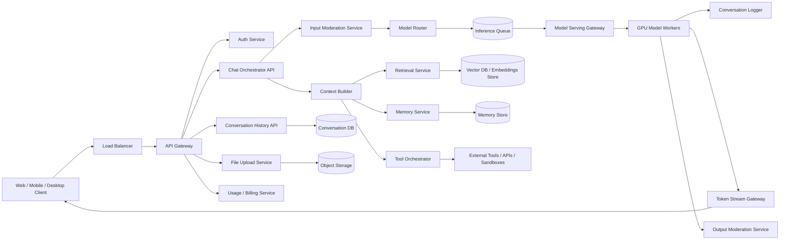

## Why this architecture works

* The **API gateway** handles auth, throttling, and routing.
* The **Chat Orchestrator** coordinates the entire request lifecycle.
* **Moderation** happens before and after generation.
* **Context Builder** prepares the prompt from history, memory, and retrieved docs.
* **Model Router** selects the best model based on task and budget.
* **Inference Queue** absorbs bursts and protects GPUs.
* **Model Serving** runs the actual LLM inference.
* **Token Stream Gateway** pushes tokens to the client as they are generated.
* **Conversation storage** and **memory stores** keep the system stateful across sessions.

---

# 6. Core Request Lifecycle

A real chat request is not one call.

It is a pipeline.

## Step-by-step flow

1. User sends a message.
2. Server authenticates the user.
3. Input safety checks run.
4. Conversation state is fetched.
5. Relevant memory is fetched.
6. Optional retrieval is performed.
7. Optional tools are planned or called.
8. Prompt is assembled.
9. Request is routed to a suitable model.
10. Inference begins.
11. Tokens are streamed back.
12. Output moderation may run inline or in parallel.
13. Chat history is stored.
14. Usage and billing metrics are recorded.

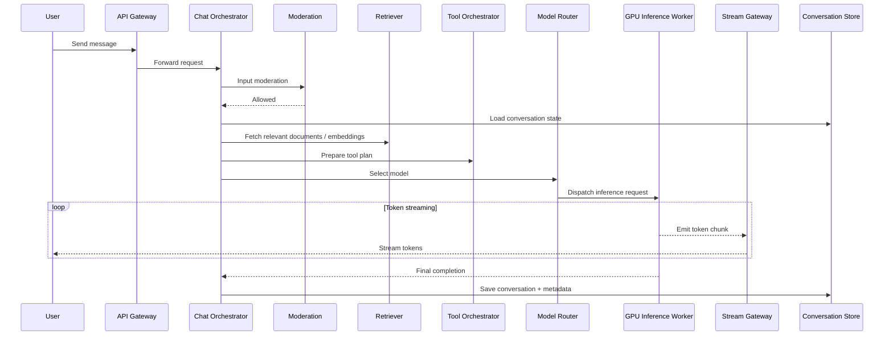

---

# 7. API Design

## 7.1 Start conversation

`POST /v1/conversations`

### Request

```json
{
  "title": "Help me write a system design",
  "model_hint": "auto"
}
```

### Response

```json
{
  "conversation_id": "conv_123",
  "created_at": "2026-05-10T10:00:00Z"
}
```

---

## 7.2 Send message

`POST /v1/conversations/{conversation_id}/messages`

### Request

```json
{
  "message_id": "msg_001",
  "role": "user",
  "content": "Design a distributed cache."
}
```

### Response

```json
{
  "accepted": true,
  "stream_id": "stream_456"
}
```

---

## 7.3 Stream response

`GET /v1/streams/{stream_id}`

This may be implemented using:

* WebSocket
* Server-Sent Events
* HTTP chunked streaming
* gRPC streaming for internal services

### Stream event example

```json
{
  "type": "token",
  "text": "A"
}
```

```json
{
  "type": "token",
  "text": "distributed"
}
```

```json
{
  "type": "done"
}
```

---

## 7.4 Conversation history

`GET /v1/conversations/{conversation_id}`

Returns:

* messages
* attachments
* tool calls
* response metadata
* timestamps
* model version used

---

## 7.5 Upload file

`POST /v1/files`

Used for PDFs, docs, spreadsheets, images, and audio.

---

# 8. Frontend Streaming Architecture

The user should see tokens appear progressively.

## Why streaming matters

Streaming improves perceived latency dramatically.

Even if the full answer takes several seconds, the user sees progress quickly and feels the system is responsive.

## How it works

The inference service emits partial token chunks as they are generated.
A stream gateway forwards them to the client immediately.

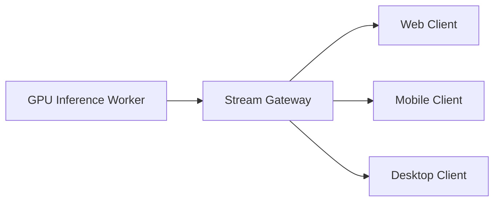

### Key detail

The model does not need to finish the entire answer before the first tokens are shown.

That is one of the defining features of a good AI assistant UX.

---

# 9. Model Serving Architecture

Model serving is the most expensive part of the system.

## Responsibilities

* load model weights
* handle batched inference
* maintain KV caches
* stream tokens
* support multiple models
* enforce quotas and timeouts
* expose inference health metrics

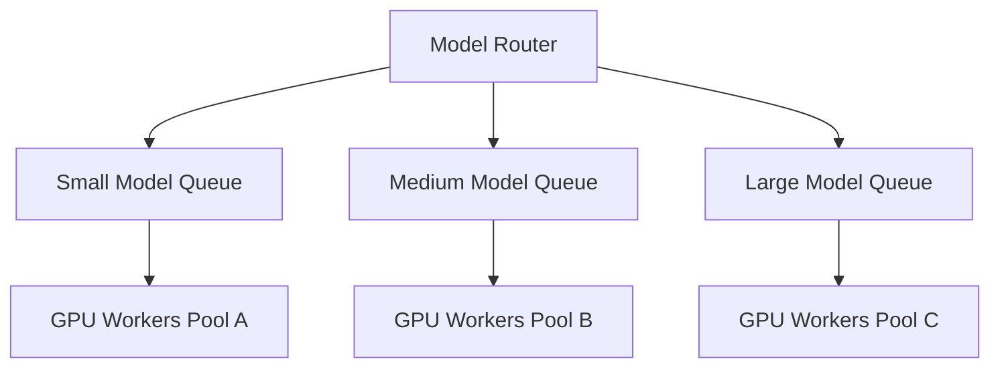

## Why multiple models

Not every query needs the largest model.

The system can route:

* simple tasks to a cheaper fast model
* complex reasoning to a larger model
* multimodal tasks to a multimodal model
* long-context tasks to a context-optimized model

This reduces cost and improves latency.

---

# 10. Model Router

The router decides which model should answer a request.

## Routing inputs

* user subscription tier
* prompt complexity
* safety risk
* required context length
* whether tools are needed
* multimodal need
* current GPU availability
* latency SLO targets
* cost budget

## Example routing logic

* simple summarization → small model
* code generation → stronger model
* image understanding → multimodal model
* enterprise document Q&A → retrieval-augmented larger model
* burst traffic → fallback to smaller model if allowed

### Why a router matters

A single giant model for every request is too expensive and often unnecessary.

Model routing is how the platform balances quality and economics.

---

# 11. Inference Queue and Backpressure

GPU capacity is finite.

The system must protect itself when demand exceeds supply.

## Why queueing is necessary

If every request directly hits the GPU fleet, the system can collapse under spike traffic.

The inference queue:

* smooths bursts
* enforces fairness
* allows prioritization
* prevents GPU overload
* supports retries and timeouts

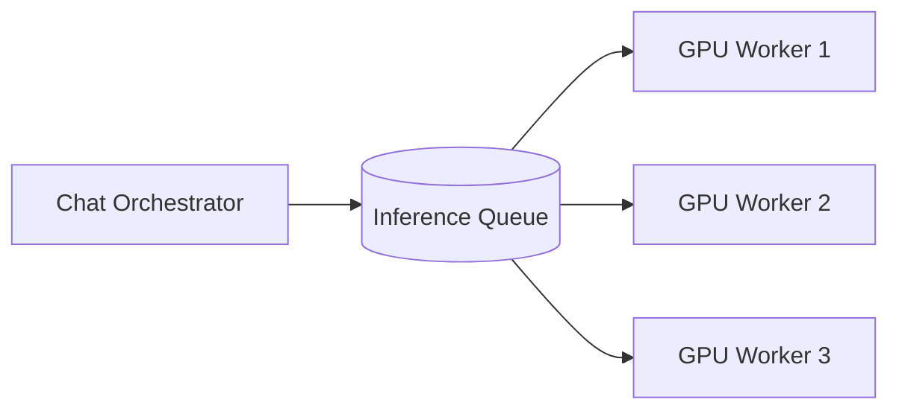

## Backpressure strategy

When the system is under pressure:

* degrade to smaller models
* reduce max output tokens
* delay non-urgent requests
* apply per-user rate limiting
* apply queue-based admission control
* reject or defer abusive traffic

This is essential to preserve service quality for everyone.

---

# 12. Context Building

An LLM does not magically know the conversation history unless the system provides it.

The context builder constructs the prompt from:

* conversation history
* latest user message
* memory
* retrieval results
* tool outputs
* system instructions
* safety policies

## Why context management is hard

Context windows are finite and expensive.

The system cannot stuff every prior message into every request forever.

So it must:

* summarize old context
* keep only relevant messages
* fetch important memory
* retrieve documents selectively
* trim low-value noise

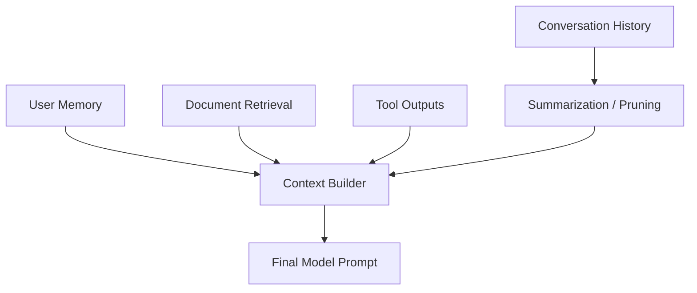

---

# 13. Conversation Storage

The system must persist the conversation reliably.

## What to store

* user message
* assistant response
* timestamps
* model id
* token counts
* tool calls
* citations or retrieved sources
* moderation outcomes
* latency metrics
* attachments

## Why this matters

Users expect to reopen a chat later and continue where they left off.

The conversation store is also needed for:

* support
* debugging
* analytics
* history search
* memory generation

### Storage choice

A relational store or scalable document store can work depending on scale.

Common pattern:

* conversation metadata in relational DB
* message events in append-only store or partitioned tables
* large attachments in object storage

---

# 14. Memory System

Memory is what makes the assistant feel personalized.

Examples:

* user prefers concise answers
* user is working on system design
* user likes Python examples
* user is preparing for interviews

## Memory types

* short-term conversation memory
* long-term user preference memory
* task-specific memory
* enterprise workspace memory

## Why memory needs careful design

Memory must be:

* useful
* explicit or policy-safe
* editable
* deletable
* scoped properly
* secure

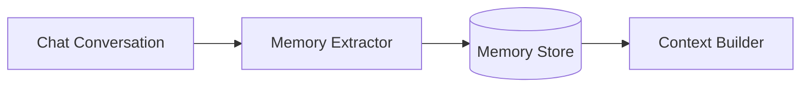

### Important

Not every detail should be remembered.
The system should only store high-value persistent signals.

---

# 15. Retrieval-Augmented Generation

For many tasks, the model should not rely only on its internal parameters.

It should retrieve relevant documents or knowledge from a corpus.

## Why retrieval matters

* improves factual grounding
* reduces hallucination risk
* enables enterprise document Q&A
* supports up-to-date or private data

## Retrieval flow

1. user asks a question
2. query is embedded or expanded
3. vector search fetches relevant chunks
4. top chunks are reranked
5. retrieved text is added to prompt

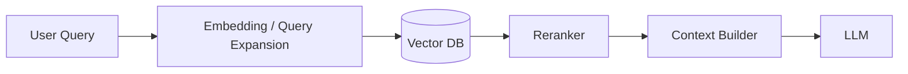

### Why vector DBs are useful

They allow semantic search, not just keyword search.

That is crucial for documents, manuals, and knowledge bases.

---

# 16. Tool Calling Architecture

Modern AI assistants often need tools:

* web search
* calculators
* code interpreters
* database queries
* calendar access
* CRM integrations
* ticketing systems
* document editors

## Tool orchestration

The model may decide to call a tool.
The backend executes it safely.
The result is inserted back into the conversation.

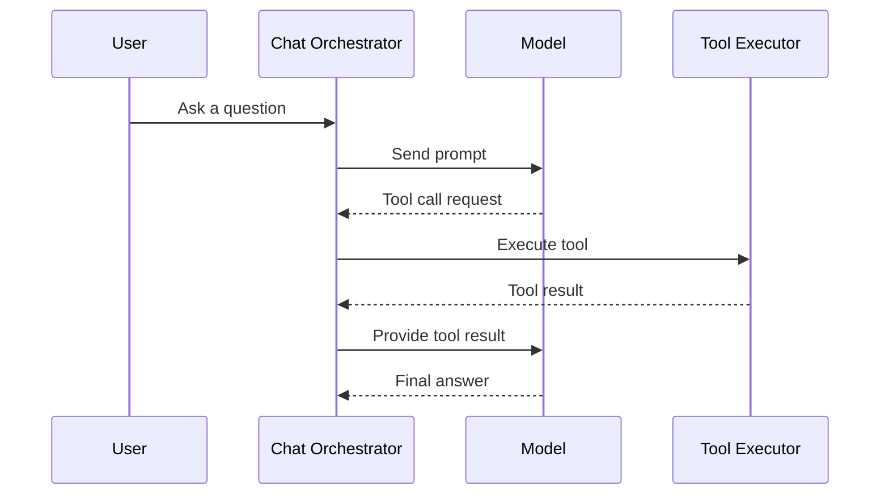

## Why tools matter

They let the assistant:

* use fresh data
* perform computations
* access enterprise systems
* reduce hallucinations

---

# 17. Safety and Moderation

Safety must happen at multiple layers.

## Moderation layers

1. input moderation before inference
2. tool-use moderation
3. retrieval filtering
4. output moderation after inference
5. policy and abuse monitoring

## Why multiple layers are necessary

A single moderation checkpoint is not enough because:

* harmful content may appear in prompts
* retrieved content may be unsafe
* tool output may be untrusted
* generated content may violate policy

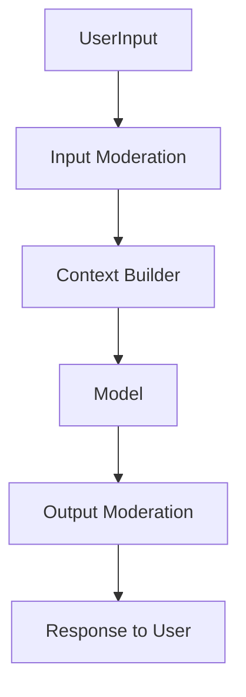

### Safety goals

* block obviously harmful requests
* reduce policy violations
* prevent prompt injection escalation
* protect minors and vulnerable users
* prevent abuse of tools and external systems

---

# 18. File and Multimodal Support

A ChatGPT-style system should support images, PDFs, audio, and sometimes spreadsheets or code archives.

## File pipeline

* upload file to object storage
* extract text and metadata
* run safety scans
* chunk and index for retrieval
* associate with conversation or workspace

## Image understanding

An image is processed by a multimodal model or a vision encoder pipeline.

## Audio

Audio may be:

* transcribed
* summarized
* directly analyzed by a multimodal model

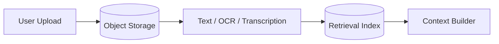

---

# 19. WebSocket / SSE / Streaming Transport

The client needs a reliable way to receive tokens in real time.

## Common options

### Server-Sent Events

* simple one-way stream
* good for token delivery
* easy in browsers

### WebSocket

* bidirectional
* good for richer interactions
* useful for live tool execution and interruption handling

### gRPC streaming

* common for internal service-to-service communication
* efficient binary transport

## Practical design

A browser client often uses SSE or WebSocket for the response stream, while internal services use gRPC.

---

# 20. Cancellation and Interruptions

Users often:

* stop generation
* ask a follow-up
* edit the prompt
* switch devices
* close the tab

The system must support cancellation.

## Why this matters

Inference is expensive.
If the user no longer needs the response, continuing to generate tokens wastes GPU time.

The stream gateway and model server should support:

* cancel signal propagation
* early termination
* resource cleanup
* partial response storage if needed

---

# 21. Conversation Summarization

Long chats cannot fit forever into context windows.

So the system needs summarization.

## Why summarization is necessary

If a conversation becomes very long:

* the prompt becomes too big
* cost rises
* latency rises
* relevant earlier information may get buried

The system should periodically create:

* summary of conversation so far
* key facts
* open tasks
* user preferences
* important retrieved citations

This summary becomes part of the context builder.

---

# 22. Caching Strategy

Caching is important, but must be done carefully.

## Good cache candidates

* repeated conversation metadata
* user profile
* memory records
* embeddings and retrieval results
* rendered conversation pages
* auth/session lookups
* model availability metadata

## Bad cache candidates

* final authoritative conversation state if it can get stale
* safety decisions without strict TTLs
* tool outputs that are time-sensitive

### Prompt cache

For repeated or near-repeated prompts, some systems use prompt caching or prefix caching to save compute.

That can be a major cost optimization for common contexts.

---

# 23. Model Memory and KV Cache

At the inference level, the model uses attention state and KV caches to avoid recomputing everything from scratch for each token.

## Why this matters

Token-by-token generation can be very expensive if the entire prefix is recomputed every time.

A good serving system:

* keeps prefixes cached where possible
* batches requests with similar prefixes
* uses continuous batching
* minimizes GPU idle time

This is one reason the model serving layer is a specialized high-performance system.

---

# 24. GPU Serving and Scheduler Design

GPU utilization is one of the biggest economic concerns.

## GPU scheduler responsibilities

* batch compatible requests
* prioritize interactive chats
* separate short and long jobs
* manage context length differences
* keep high utilization without hurting latency

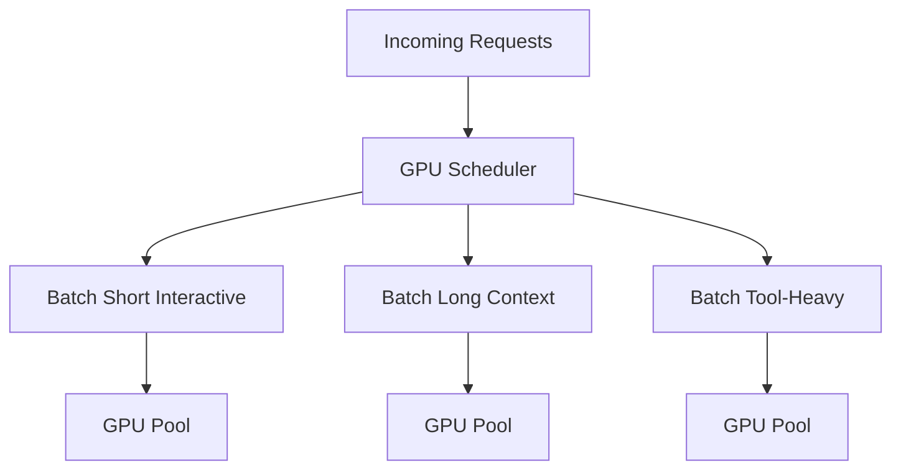

### Why batching matters

GPU inference is much cheaper per token when requests are batched intelligently.

But batching must not add too much latency, especially for interactive users.

So the scheduler balances:

* throughput
* latency
* fairness
* cost

---

# 25. High Availability

The system must survive many failures.

## Failure scenarios

* one GPU worker crashes
* a model shard fails
* retrieval DB is slow
* safety service times out
* tool executor fails
* conversation store becomes unavailable
* one region goes down

## Resilience strategies

* redundant model replicas
* health checks
* queue-based retry
* graceful degradation
* fallback to smaller models
* cached responses for repeated queries
* region failover

### Graceful degradation examples

If retrieval fails:

* answer without retrieval but warn carefully

If tool execution fails:

* answer based on available knowledge or ask user to retry

If large model is overloaded:

* route to smaller model or delay non-urgent requests

---

# 26. Multi-Region Architecture

A global AI assistant should run across regions.

## Goals

* reduce latency by serving near the user
* isolate failures
* handle regional traffic spikes
* support data residency constraints when needed

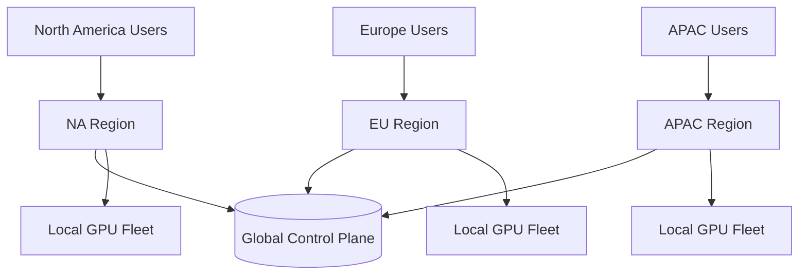

## Tradeoffs

Some data may be global:

* model weights
* shared policies
* billing config

Some data may be regional:

* conversation storage
* user memory
* logs
* enterprise data

The platform should keep state close to the user when possible while maintaining global control and policy consistency.

---

# 27. Billing and Quotas

Inference is expensive, so the platform needs usage accounting.

## Billing dimensions

* input tokens
* output tokens
* tool calls
* retrieval queries
* image processing
* file processing
* premium model access
* concurrency limits

### Why billing matters

Without quotas and metering:

* abuse can become ruinous
* GPU costs can spiral
* product tiers become impossible to enforce

The billing service should be fast, reliable, and tightly integrated with the router.

---

# 28. Observability

You cannot run this platform blindly.

## Important metrics

| Metric                 | Why it matters                |
| ---------------------- | ----------------------------- |
| Time to first token    | User-perceived responsiveness |
| Total response latency | End-to-end speed              |
| Queue wait time        | Capacity pressure             |
| GPU utilization        | Cost and throughput           |
| Token throughput       | Inference efficiency          |
| Moderation reject rate | Safety and abuse trends       |
| Retrieval latency      | RAG responsiveness            |
| Tool failure rate      | External system health        |
| Stream disconnect rate | Client network quality        |
| Cost per chat          | Business efficiency           |

## Tracing

Each request should be traceable across:

* gateway
* moderation
* context retrieval
* model routing
* GPU inference
* tool calls
* streaming
* storage
* billing

This is essential for debugging user complaints and performance regressions.

---

# 29. Data Model

A practical platform needs multiple entity types.

| Entity          | Purpose                    |
| --------------- | -------------------------- |
| User            | Account and profile        |
| Conversation    | Chat thread                |
| Message         | User or assistant turn     |
| Stream          | Response streaming session |
| ModelInvocation | Inference request metadata |
| ToolCall        | External action call       |
| MemoryRecord    | Persistent user preference |
| File            | Uploaded document or media |
| EmbeddingChunk  | Retrieval representation   |
| SafetyEvent     | Moderation and policy logs |
| UsageRecord     | Billing and quotas         |

---

# 30. Storage Choices

## Conversation store

Use a scalable database for chat history:

* PostgreSQL for smaller scale
* sharded SQL or NoSQL for very large scale

## Memory store

Use a dedicated store for user preferences and long-term memory.

## Vector store

Use a vector database for semantic retrieval.

## Object storage

Use for files, screenshots, audio, and artifacts.

## Event bus

Use Kafka or an equivalent for analytics, logs, moderation events, and async processing.

---

# 31. End-to-End Response Streaming Flow

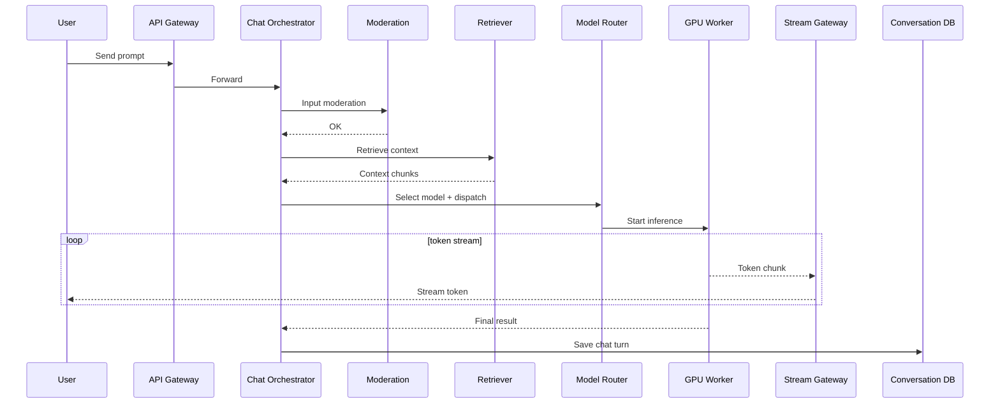

This is the heart of the whole system.

The user experiences a fast, smooth, streaming assistant, while the backend performs several coordinated steps in parallel.

---

# 32. Prompt Injection and Tool Safety

When tool use and retrieval are allowed, prompt injection becomes a real threat.

Examples:

* malicious document tries to override instructions
* retrieved text contains dangerous commands
* tool output includes untrusted instructions

## Defense strategy

* separate trusted system instructions from untrusted retrieval content
* sanitize tool outputs
* restrict tool capabilities
* enforce allowlists
* log and inspect suspicious behavior
* use policy-aware tool execution

This is critical for enterprise and agentic use cases.

---

# 33. Rate Limiting and Abuse Handling

A popular AI assistant will be abused.

## Abuse patterns

* automated scraping
* token flooding
* prompt injection attempts
* spam generation
* quota exhaustion
* tool abuse
* brute-force model probing

## Protections

* token-based quotas
* per-user and per-IP limits
* anomaly detection
* session scoring
* captcha for suspicious signups
* model access tiering
* sandboxing tool execution

---

# 34. Fallback and Degradation Modes

A good system does not fail all at once.

## Degradation options

* smaller model fallback
* no-tool mode
* no-retrieval mode
* delayed non-urgent responses
* reduced max output tokens
* disabled multimodal processing if overloaded
* cached help responses for common queries

### Why this matters

The user would rather get a slightly weaker answer than no answer at all.

---

# 35. Production Deployment Considerations

This platform needs careful rollout and model management.

## Deployment patterns

* blue-green for control plane
* canary for model versions
* A/B experiments for model routing
* gradual traffic ramp for new GPUs or model checkpoints
* rollback capability when quality regresses

## Why careful rollout matters

Changing a model can change:

* quality
* safety behavior
* latency
* cost
* tool calling patterns

So model deployment is a product and operations problem, not just an ML problem.

---

# 36. Final Architecture Diagram

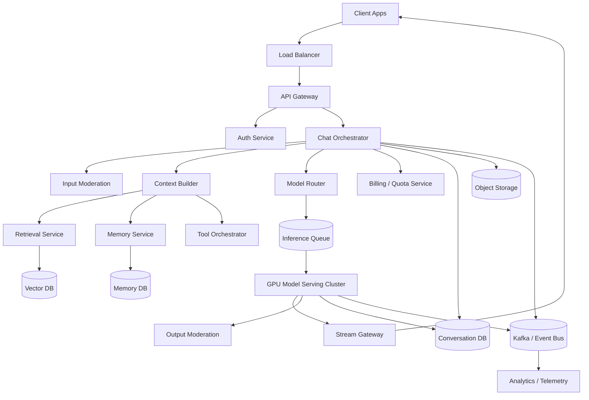

---

# 37. Conclusion

A ChatGPT-style real-time AI platform is a very large distributed system that combines:

* real-time streaming
* GPU inference
* context management
* retrieval
* tool orchestration
* memory
* moderation
* billing
* observability
* multi-region reliability

The major engineering principles are:

* **separate the control plane from the inference plane**
* **stream tokens as they are generated**
* **route requests to the right model**
* **build context carefully instead of stuffing everything blindly**
* **use retrieval and memory to improve quality**
* **moderate inputs and outputs at multiple layers**
* **use queueing and backpressure to protect GPUs**
* **support cancellation, retries, and graceful degradation**
* **store conversation history and usage reliably**
* **design for cost as seriously as you design for latency**

A production AI assistant is not just a model behind an API.

It is a carefully engineered real-time system that turns a user prompt into a safe, coherent, low-latency streamed response at global scale.

If you want, I can also produce a deeper follow-up version with separate sections for **LLM serving internals**, **KV cache and batching**, **RAG architecture**, **agent/tool execution**, **memory design**, and **multi-region GPU orchestration**.
