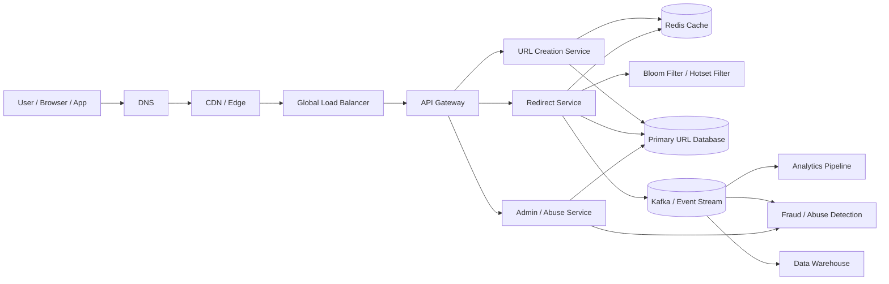
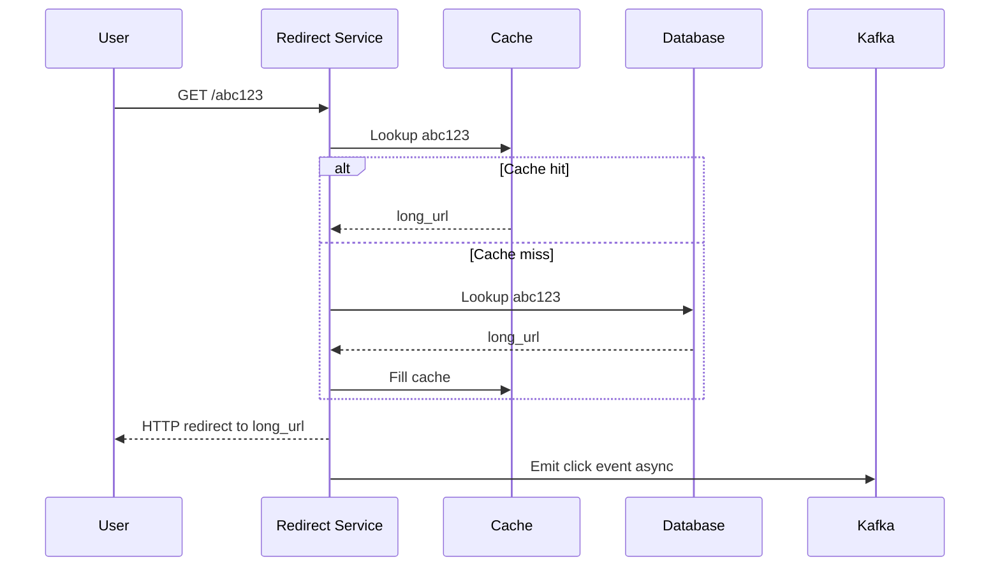
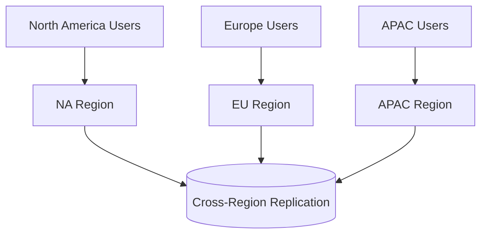
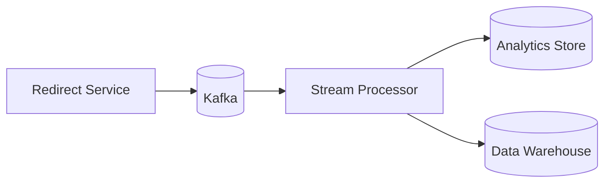
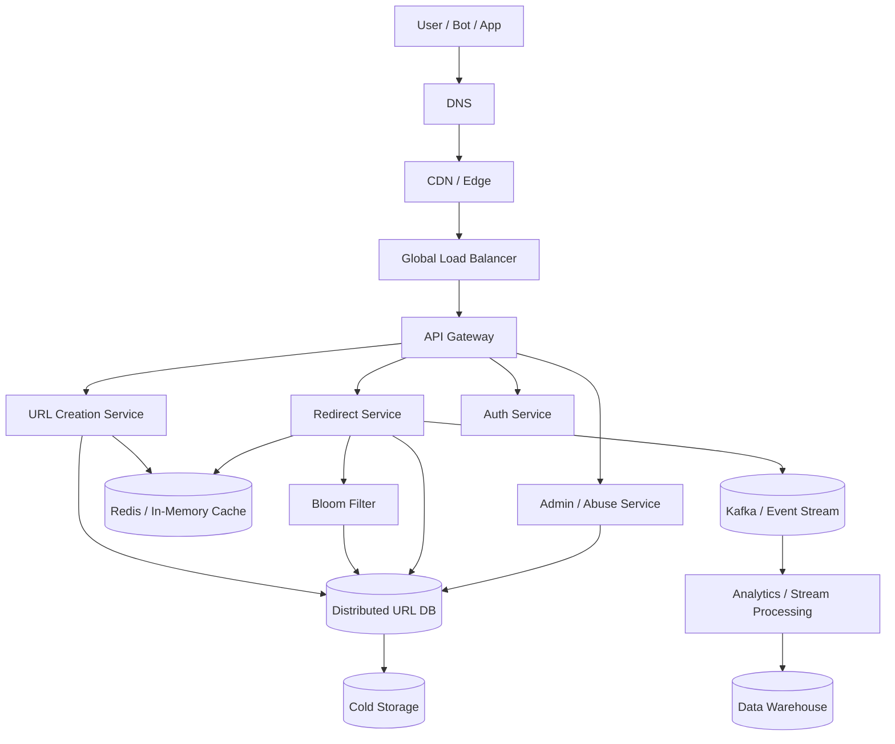

# Design a URL Shortener

A URL shortener seems simple at first.

A user submits a long URL.
The system returns a short one.
When someone opens the short link, they get redirected to the original destination.

That is the user-facing behavior.

Underneath, a real production URL shortener must handle:

* enormous redirect traffic
* low-latency redirection
* custom aliases
* link expiration
* analytics and click tracking
* anti-abuse checks
* deduplication and idempotency
* hot-link protection
* multi-region availability
* disaster recovery
* cache efficiency
* durable storage
* safe and scalable short code generation

At scale, the system becomes a **read-heavy, latency-critical distributed service**.

The most important thing to understand is this:

> creating short URLs is the easy part; serving billions of redirects reliably is the hard part.

---

# 1. Introduction

## Problem statement

Build a URL shortener that can:

* accept long URLs
* generate short links
* redirect users quickly
* support custom aliases
* expire links
* collect click analytics
* prevent abuse and malicious URLs
* scale to internet traffic
* remain available across regions

## Real-world scale

A serious URL shortener may see:

* tens or hundreds of millions of shortened URLs
* billions of redirect requests
* a few write requests compared to an enormous number of read requests
* huge bursts when short links go viral

## Why this problem is difficult

The hard parts are not URL parsing or database inserts.

The hard parts are:

* generating unique short codes at scale
* keeping redirect latency extremely low
* preventing a single viral link from overloading origin infrastructure
* supporting analytics without slowing redirects
* handling link spam and phishing
* keeping services online during regional failures

A good URL shortener is really a **global redirect and tracking system**.

---

# 2. Functional Requirements

The system should support:

| Requirement      | Description                               |
| ---------------- | ----------------------------------------- |
| Shorten URL      | Convert a long URL into a short code      |
| Redirect         | Resolve short code to original URL        |
| Custom Alias     | Allow user-chosen short path              |
| Expiration       | Support TTL or expiry date                |
| Analytics        | Track clicks, geography, device, referrer |
| Link Management  | Update, disable, delete, restore          |
| User Accounts    | Own and manage created links              |
| Abuse Prevention | Block malware, spam, phishing             |
| Rate Limiting    | Prevent API abuse and link flooding       |
| Admin Controls   | Review and disable malicious links        |
| Custom Domains   | Support branded domains                   |

---

# 3. Non-Functional Requirements

| Property          | Goal                                |
| ----------------- | ----------------------------------- |
| Low latency       | Redirect should be near instant     |
| High availability | Service should survive failures     |
| Scalability       | Must support huge redirect traffic  |
| Durability        | Links must not be lost              |
| Consistency       | Redirects must resolve correctly    |
| Security          | Block malicious or illegal URLs     |
| Observability     | Measure redirect latency and health |
| Cost efficiency   | Keep redirects cheap to serve       |

---

# 4. Capacity Estimation

Let us assume a global-scale service.

## Assumptions

* 100 million shortened links
* 5 billion redirects per day
* 50 million create requests per day
* 99% of traffic is redirect traffic
* 1% or less is write traffic

## Request rate

For 5 billion redirects/day:

```text
5,000,000,000 / 86,400 ≈ 57,870 redirects/sec average
```

Peak traffic could easily be 5x–20x higher due to viral links, social media amplification, or campaigns.

So the platform should be designed for:

* tens of thousands of redirects per second average
* hundreds of thousands or more during peaks

## Storage estimate

Assume each link record stores:

* short code
* original URL
* metadata
* owner info
* timestamps
* status
* expiration
* analytics counters

A record can easily be 300–1000 bytes depending on indexing and metadata.

For 100 million links at ~500 bytes each:

```text
100,000,000 × 500 bytes = 50,000,000,000 bytes ≈ 50 GB raw
```

With replicas, indexes, and backup copies, real operational storage is much higher.

## Bandwidth

Redirect responses are very small compared to video or media systems, but the sheer request volume is massive.

A redirect service must therefore optimize:

* response headers
* cache hits
* DB lookups
* edge routing

---

# 5. High-Level Architecture



## Why this architecture works

* The **API Gateway** protects the backend and handles routing.
* The **Creation Service** handles short code generation and validation.
* The **Redirect Service** is optimized for extremely fast lookups.
* The **Cache** absorbs most redirect traffic.
* The **Bloom Filter** helps avoid pointless DB lookups for nonexistent codes.
* **Kafka** decouples click tracking from the redirect path.
* **Analytics** runs asynchronously so redirects stay fast.

---

# 6. Core System Principle

A URL shortener should be designed around this principle:

> redirect path must be faster than analytics path.

That means:

* redirects must not wait for click tracking writes
* analytics must be async
* cache should be the first lookup layer
* DB should be the fallback layer
* failure in analytics must never break redirect

This is a classic production design rule.

---

# 7. API Design

## 7.1 Create short URL

`POST /v1/shorten`

### Request

```json
{
  "long_url": "https://www.example.com/articles/designing-distributed-systems/deep-dive",
  "custom_alias": "systemdesign",
  "expire_at": "2026-12-31T23:59:59Z"
}
```

### Response

```json
{
  "short_url": "https://sho.rt/systemdesign",
  "short_code": "systemdesign",
  "long_url": "https://www.example.com/articles/designing-distributed-systems/deep-dive",
  "status": "active"
}
```

---

## 7.2 Redirect

`GET /{short_code}`

This endpoint should return:

* `301 Moved Permanently` for permanent links
* `302 Found` or `307 Temporary Redirect` for temporary links

### Redirect flow



---

## 7.3 Link analytics

`GET /v1/links/{short_code}/stats`

Returns:

* total clicks
* clicks by country
* clicks by device
* clicks by date
* referrers
* user agent breakdown

---

## 7.4 Update link

`PATCH /v1/links/{short_code}`

Used to:

* change destination
* update expiration
* disable link

---

# 8. Database Design

The database stores the mapping between short code and long URL.

## Main URL table

| Column      | Type      | Description                        |
| ----------- | --------- | ---------------------------------- |
| short_code  | string    | Unique short identifier            |
| long_url    | text      | Destination URL                    |
| user_id     | string    | Owner                              |
| created_at  | timestamp | Creation time                      |
| expire_at   | timestamp | Expiry time                        |
| status      | string    | active, disabled, deleted, expired |
| is_custom   | boolean   | Whether alias is custom            |
| click_count | bigint    | Aggregate counter                  |
| checksum    | string    | Integrity check                    |

## Analytics table

Analytics should usually not live in the primary OLTP database if volume is high.

A separate analytics store should hold:

* click events
* country
* device
* browser
* referrer
* timestamp
* IP hash or anonymized region tags

This keeps the primary write path clean.

---

# 9. Short Code Generation

This is one of the central design decisions.

A short code must be:

* unique
* compact
* easy to generate
* easy to resolve
* scalable
* safe from collisions

## Option 1: Base62 encoding of a unique numeric ID

This is usually the best production choice.

Example numeric ID:

```text
123456789
```

Base62 encoding converts it to a shorter alphanumeric string.

Base62 alphabet:

* a-z
* A-Z
* 0-9

### Why Base62 is good

* compact
* URL-safe
* easy to decode
* deterministic
* very scalable

---

## Option 2: Hash of long URL

This may look attractive, but it is usually not ideal by itself.

Problems:

* collisions are possible
* identical long URLs would always map to the same short code unless additional logic is added
* changing one character in the URL produces a completely different code
* custom aliases become awkward

Hashing can still be useful for deduplication or canonicalization, but not as the sole short code strategy.

---

## Option 3: Distributed ID generation

To support massive scale, generate unique IDs using:

* central sequence service
* Snowflake-style distributed ID generation
* pre-allocated ID blocks

Then encode the numeric ID into Base62.

### Example

* internal numeric ID: `987654321`
* Base62 code: `g5Hk2`

This is simple and production friendly.

---

# 10. ID Generation at Scale

A single central counter can become a bottleneck.

There are several practical strategies.

## Strategy 1: Central ID service

A dedicated service allocates IDs sequentially.

Pros:

* simple
* no collisions

Cons:

* can become a hotspot
* availability must be high

---

## Strategy 2: Pre-allocated blocks

Each app server gets a block of IDs from the ID service.

Example:

* server A gets 1,000,000–1,999,999
* server B gets 2,000,000–2,999,999

Pros:

* reduces central contention
* scalable

Cons:

* block waste if a server crashes

---

## Strategy 3: Snowflake-style distributed IDs

Combine:

* timestamp
* machine ID
* sequence number

Pros:

* highly scalable
* no central bottleneck

Cons:

* more complex
* must manage clock drift carefully

For a URL shortener, **pre-allocated blocks or Snowflake-style IDs** are the most practical options.

---

# 11. Redirect Path Design

The redirect path is the most performance-sensitive part of the system.

## Redirect requirements

* extremely low latency
* very high availability
* tiny CPU overhead
* minimal external calls
* cache-first resolution

## Redirect flow

1. user requests `/{short_code}`
2. service checks local in-memory cache or Redis
3. if hit, immediately return redirect
4. if miss, query database
5. fill cache
6. return redirect
7. asynchronously emit click event

```mermaid
flowchart TD
    A[Incoming GET /{short_code}] --> B[Edge / CDN / LB]
    B --> C[Redirect Service]
    C --> D{Cache hit?}
    D -->|Yes| E[Return redirect immediately]
    D -->|No| F[DB lookup]
    F --> G{Found?}
    G -->|Yes| H[Populate cache]
    H --> E
    G -->|No| I[404 / 410 response]
```

### Why click logging must be async

If redirect waits for analytics write, latency goes up and throughput drops.

A user cares about being redirected.
Analytics can arrive a few milliseconds or seconds later.

---

# 12. Caching Strategy

Cache is critical.

Redirect traffic is much larger than creation traffic, so the cache must absorb the majority of reads.

## Cache layers

### L1: In-process memory cache

Very fast, small size, best for hot URLs.

### L2: Redis cluster

Shared cache for all app servers.

### L3: Database fallback

Used only on cache miss or cold start.

## What to cache

* short_code → long_url
* short_code → status
* short_code → expiration info
* short_code → redirect type

### Why cache is powerful

A viral short link may receive millions of clicks.
If every click hits the database, the system can collapse.
A cache turns repeated reads into memory lookups.

---

# 13. Bloom Filter for Nonexistent Codes

A Bloom filter can help reject invalid short codes quickly.

## Why use it

Many requests may be:

* typos
* bots
* random scans
* invalid codes

If the system can quickly determine that a code almost certainly does not exist, it can avoid wasted DB lookups.

## Tradeoff

Bloom filters can produce false positives but not false negatives.

That means:

* if Bloom says “not present,” you can safely reject
* if Bloom says “present,” you still verify in cache or DB

This improves performance and lowers backend load.

---

# 14. CDN and Edge Optimization

A CDN can help with:

* edge termination
* geographic routing
* cached redirect responses
* DDoS protection
* faster access close to the user

## Why CDN matters

Short URL traffic can be geographically distributed.
Pushing redirect handling closer to the edge reduces latency.

### When CDN caching is useful

* highly popular links
* static permanent redirects
* custom brand domains
* campaign links

### When CDN is less useful

* personalized dynamic redirects
* rapidly changing link destinations
* links with strict auth policies

---

# 15. Multi-Region Architecture

A global service should not depend on one region.

## Goals

* low latency for users worldwide
* failover during region outages
* continued read availability
* geographically replicated link mappings



## Practical design

* one write primary per link or shard
* replicated read copies in other regions
* async replication for analytics and metadata
* DNS or global load balancer routes users to nearest healthy region

### Tradeoff

Strong global consistency is expensive and unnecessary for most shortener use cases.
Eventual consistency with safe redirects is usually the correct tradeoff.

---

# 16. Replication and Consistency

## Read consistency

Redirects can usually tolerate read replicas if replication lag is small.

## Write consistency

Creation must be durable before the response returns.

That means:

* link creation should be acknowledged only after the mapping is stored safely
* the DB write should be replicated enough to survive failures

## What can be eventually consistent

* click analytics
* counter aggregation
* dashboards
* fraud scoring
* trending statistics

## What should be strongly durable

* the mapping itself
* custom alias uniqueness
* expiration state
* link disable/enable status

---

# 17. Collision and Uniqueness Handling

If the system generates a short code automatically, collisions must be avoided.

## How to enforce uniqueness

* use unique DB constraint on `short_code`
* retry code generation if a collision occurs
* pre-allocate ID blocks or use distributed IDs to reduce collision probability

## Custom alias conflicts

If a user requests:

```text
sho.rt/summer
```

and that alias already exists, the system must reject or suggest alternatives.

This is a straightforward but important part of the write path.

---

# 18. Custom Alias Support

Custom aliases are useful for branding and memorability.

Examples:

* `sho.rt/sale`
* `sho.rt/docs`
* `sho.rt/event2026`

## Validation rules

* length limits
* allowed characters
* reserved words
* profanity filters
* uniqueness check
* abuse check

Custom aliases should be treated as premium or controlled resources because they are scarce and more likely to be abused.

---

# 19. Link Expiration and Lifecycle

Links may expire for:

* campaigns
* temporary promotions
* safety reasons
* user-specified TTL

## Link states

| State       | Meaning                          |
| ----------- | -------------------------------- |
| active      | Redirect works                   |
| expired     | Time-based expiration reached    |
| disabled    | Admin or owner disabled the link |
| deleted     | Link removed or soft-deleted     |
| quarantined | Under abuse review               |

### Expired link response

A good design returns:

* `410 Gone` for expired links
* `404 Not Found` for nonexistent links

This distinction is useful and more semantically correct.

---

# 20. Abuse Prevention and Security

URL shorteners are frequently abused.

They can hide:

* phishing
* malware
* spam campaigns
* tracking abuse
* malicious redirects

## Security defenses

* URL reputation scanning
* malware checks
* safe browsing integration
* domain blacklists
* pattern-based abuse detection
* rate limiting
* sandboxed preview inspection
* manual admin review

## Why this matters

A short link is designed to be opaque.
That makes it attractive to attackers.
Security is therefore a first-class requirement.

---

# 21. Rate Limiting

The platform should limit:

* link creation per user
* API requests per IP
* custom alias attempts
* suspicious redirect bursts
* invalid code scans

## Implementation

A token bucket or leaky bucket algorithm backed by Redis is a common choice.

### Example limits

* anonymous creation: very limited
* authenticated user creation: moderate
* enterprise API key: higher quota
* suspicious traffic: tightened or blocked

Rate limiting protects both infrastructure and abuse response.

---

# 22. Analytics Pipeline

Analytics should never block redirects.

## Event types

* click event
* referrer
* country
* device
* browser
* timestamp
* link state
* response type

## Pipeline

1. redirect happens immediately
2. click event emitted to Kafka
3. stream processor enriches event
4. analytics store and warehouse update
5. dashboard reads aggregated data



## Why asynchronous analytics is essential

Tracking can fail without affecting the user-facing redirect flow.
That is the correct separation of concerns.

---

# 23. Search and Preview Features

Some URL shorteners offer:

* link previews
* destination metadata
* title extraction
* safe browsing warnings
* QR codes

These are useful but secondary features.

### Important design rule

Do not fetch or preview destination URLs on the hot redirect path.
If previews are needed, they should be done asynchronously or at creation time with careful sandboxing.

---

# 24. API Keys and Developer Platform

Many URL shorteners offer API access to partners or business users.

## Developer features

* API key management
* usage quotas
* custom domains
* analytics exports
* webhooks
* bulk creation
* campaign tagging

This turns the shortener into a platform, not just a utility.

---

# 25. Data Model

A practical schema might include:

## Links table

| Field        | Type      | Notes                   |
| ------------ | --------- | ----------------------- |
| short_code   | string    | Primary key             |
| long_url     | text      | Destination             |
| user_id      | string    | Owner                   |
| created_at   | timestamp | Creation                |
| expire_at    | timestamp | Expiration              |
| status       | enum      | active/expired/disabled |
| click_count  | bigint    | Counter                 |
| custom_alias | boolean   | Alias type              |
| metadata     | json      | Optional tags           |

## Click events table

| Field           | Type      | Notes                        |
| --------------- | --------- | ---------------------------- |
| event_id        | string    | Unique ID                    |
| short_code      | string    | Link                         |
| timestamp       | timestamp | Event time                   |
| referrer        | string    | Source                       |
| country         | string    | Geo                          |
| device          | string    | Device type                  |
| user_agent_hash | string    | Privacy-friendly fingerprint |

---

# 26. Sharding Strategy

As the dataset grows, the database must be sharded.

## Good shard key

Short code hash is usually a good choice.

```text
shard = hash(short_code) % N
```

### Why this works

* evenly distributes data
* avoids hot partitions caused by sequential IDs
* supports horizontal scale

## Alternative

Shard by user ID if per-user management and quotas matter heavily.

That can simplify account-based dashboards but may create hotspots for power users.

---

# 27. Hot Link Problem

A viral link can get enormous traffic.

Example:

* celebrity post
* major news event
* campaign landing page

## Risk

One short link might receive millions of clicks per minute.

## Mitigations

* cache at edge and Redis
* replicate hot records
* keep redirect path CPU-light
* async analytics
* autoscale redirect servers
* consider CDN response caching for permanent links

This is one of the most important practical issues in URL shortening.

---

# 28. Data Lifecycle and Archival

Not all links need to stay hot forever.

## Lifecycle strategy

* active links remain in fast storage
* old and inactive links can move to cold storage
* expired links can be retained for audit or deleted per policy

### Why archive

* reduce cost
* simplify active dataset
* preserve analytics history
* support compliance and user requests

---

# 29. Observability

A URL shortener must be observable.

## Important metrics

| Metric           | Why it matters              |
| ---------------- | --------------------------- |
| Redirect latency | User experience             |
| Cache hit rate   | Performance and cost        |
| DB read latency  | Backend load                |
| Create latency   | Write path health           |
| 404 / 410 rate   | Invalid/expired link trends |
| Click event lag  | Analytics freshness         |
| Abuse flags      | Security monitoring         |
| CDN hit ratio    | Edge effectiveness          |

## Logging

Every request should log:

* request id
* short code
* region
* cache hit/miss
* response status
* timing breakdown

This helps diagnose hot links, failures, and abuse.

---

# 30. Failure Scenarios

## Cache failure

Fallback to DB, then repopulate cache.

## DB failure

Use replicas and failover.

## Region failure

Route traffic to another region with replicated data.

## Kafka failure

Redirects continue; analytics may lag until Kafka recovers.

## Bloom filter false positive

No issue; DB verifies the mapping.

The redirect flow should remain available even if non-critical subsystems are degraded.

---

# 31. CAP Theorem Considerations

URL shorteners generally favor:

* **Availability**
* **Partition tolerance**

Why?
Because a redirect should work even if some replicas or analytics systems are partitioned.

It is better to serve a slightly stale but valid redirect than to fail the redirect entirely.

### Consistency tradeoff

For the mapping itself, you want strong durability on create.
For analytics and dashboards, eventual consistency is acceptable.

---

# 32. Advanced Optimizations

## 32.1 In-memory hotset

Keep the most frequently accessed links in local memory on redirect servers.

## 32.2 Negative cache

Cache nonexistent or expired codes briefly to avoid repeated DB misses.

## 32.3 Prefix/range optimization

If short codes are sequential or partially structured, prefetching and locality-aware caching may help.

## 32.4 Read replicas

Use replicas for redirect reads while maintaining durable writes on primaries.

## 32.5 Edge redirect caching

For stable, permanent links, edge caches can reduce origin load significantly.

---

# 33. Final Architecture Diagram



---

# 34. Conclusion

A production URL shortener is a simple product built on top of a very serious distributed system.

The right architecture uses:

* **Base62 or distributed ID generation** for compact unique codes
* **Redis and in-memory caches** to absorb the huge redirect load
* **DB replication and sharding** for durability and scale
* **Kafka-based analytics** so tracking never slows redirects
* **Bloom filters** to reduce wasted lookups
* **CDN and edge routing** to lower latency globally
* **rate limiting and abuse detection** to keep the system safe
* **multi-region deployment** to stay available during failures

The redirect path must be extremely fast, and everything else must be designed around protecting it.

That is the core idea behind an industry-grade URL shortener.

If you want, I can now turn this into a **full staff-level design doc** with deeper sections on:
**Base62 ID generation, distributed sharding, Redis cluster topology, CDN redirect caching, analytics schema, and multi-region failover**.
