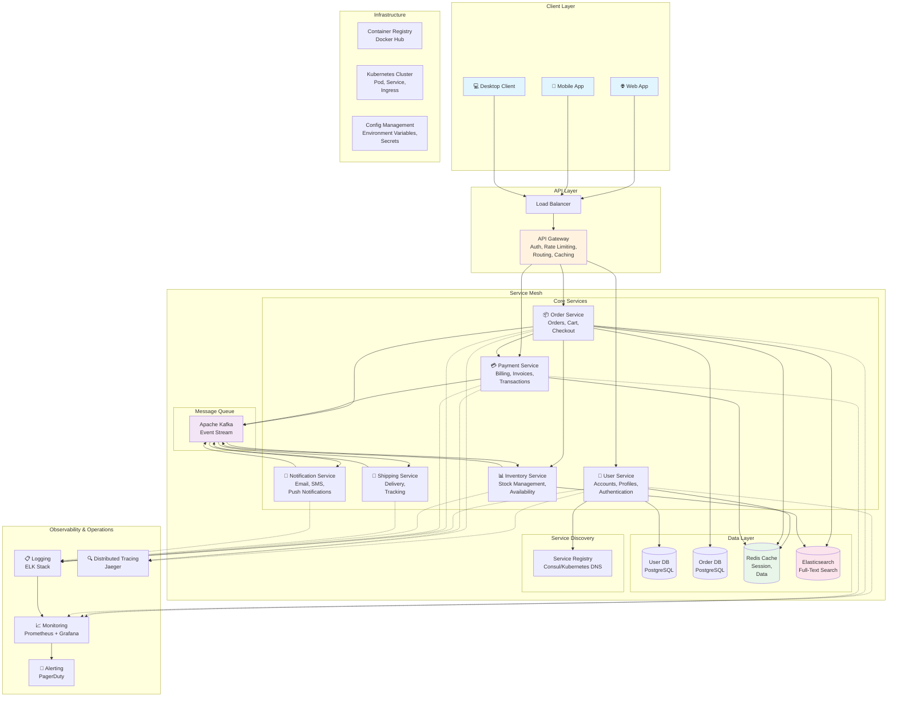
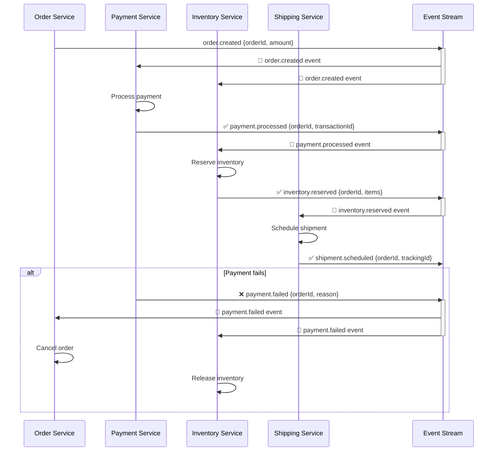
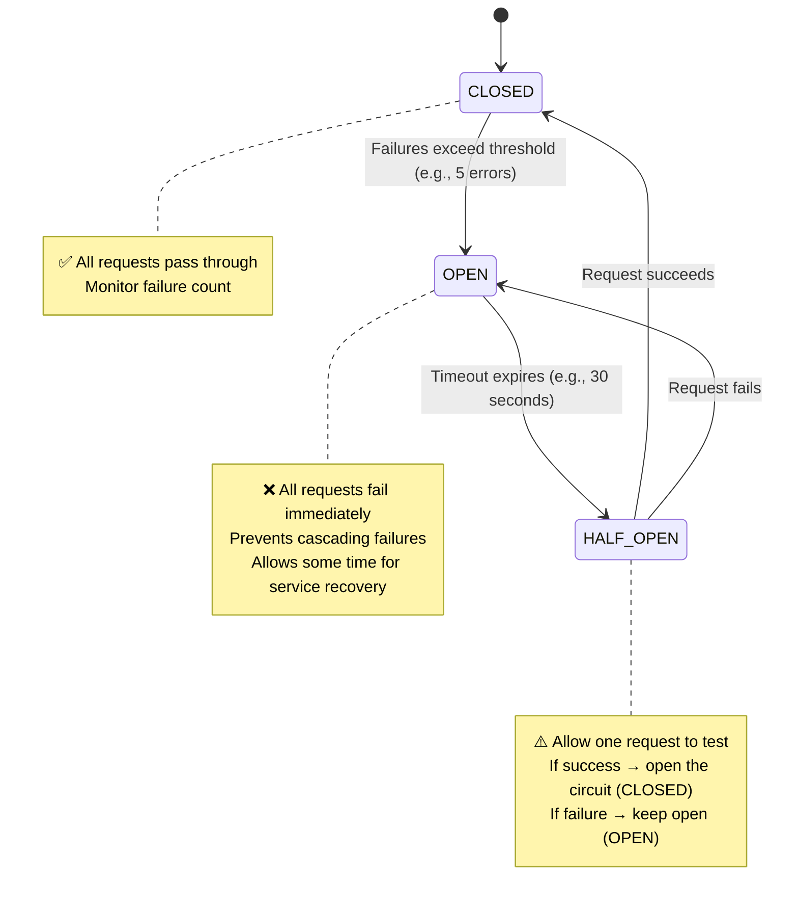

# Microservices Architecture

Microservices is an architectural style that structures an application as a collection of small, independently deployable services, each running its own process and communicating via APIs.

## Complete Microservices Ecosystem

Here's how a modern microservices system comes together:



This diagram shows:
- **Client Layer** — Multiple frontend applications
- **API Gateway** — Single entry point handling cross-cutting concerns
- **Core Services** — Domain-driven services with independent databases
- **Message Queue** — Asynchronous communication between services
- **Data Layer** — Polyglot persistence (different DBs for different needs)
- **Service Registry** — Services discover each other dynamically
- **Observability** — Centralized logging, monitoring, tracing, and alerting
- **Infrastructure** — Container orchestration and deployment

## Monolith vs Microservices

### Monolith

All functionality in a single deployable unit.

**Pros:**
- Simple to develop, test, and deploy initially
- Easy cross-module calls (in-process)
- No network latency between components

**Cons:**
- Scales as a whole unit (can't scale just the hot path)
- One bug can take down the entire system
- Long build/deploy cycles as code grows
- Technology lock-in across teams

### Microservices

Each domain is its own service.

**Pros:**
- Independent deployment and scaling
- Teams own their services end-to-end
- Technology freedom per service
- Fault isolation

**Cons:**
- Network latency between services
- Distributed transactions are hard
- Operational complexity (service mesh, discovery, monitoring)
- Testing is harder

---

## Domain-Driven Design Boundaries

Services should align with business domains (bounded contexts), not technical layers.

**Anti-pattern (technical split):**
```
Database Service → Business Logic Service → API Service
```

**Correct (domain split):**
```
User Service   → owns user accounts, auth, profiles
Order Service  → owns orders, carts, checkout
Payment Service → owns billing, invoices, refunds
Notification Service → owns email, SMS, push
```

---

## Service Communication

### Synchronous (REST / gRPC)

```
Order Service --HTTP POST /payments--> Payment Service
                    ← 200 OK { transactionId }
```

**Use when:** You need an immediate response to continue processing.

**gRPC advantages over REST:**
- Binary protocol (Protocol Buffers) — faster, smaller
- Strongly typed contracts via `.proto` files
- Bidirectional streaming support

---

### Asynchronous (Message Queue)

```
Order Service → [Queue: order.placed] → Notification Service
                                      → Inventory Service
                                      → Analytics Service
```

**Use when:** The caller doesn't need an immediate response; multiple consumers; resilience to downstream failures.

**Technologies:** Kafka, RabbitMQ, AWS SQS/SNS

---

## Service Discovery

How do services find each other when IPs change dynamically?

### Client-Side Discovery

Each service queries a registry (e.g., Consul, Eureka) to find available instances, then load balances itself.

```
Order Service → Consul → [Payment Service: 10.0.1.5:8080, 10.0.1.6:8080]
             → picks 10.0.1.5:8080
```

### Server-Side Discovery

A load balancer handles discovery. Services just call the load balancer.

```
Order Service → Load Balancer → Payment Service instances
```

**Kubernetes** implements this via `Service` objects — DNS name resolves to the load balancer.

---

## API Gateway

A single entry point for all clients.

```
Mobile App ──┐
Web App    ──┤──→ API Gateway ──→ User Service
3rd Party  ──┘              ├──→ Order Service
                            └──→ Payment Service
```

**Responsibilities:**
- Authentication & authorization (JWT validation)
- Rate limiting
- Request routing
- SSL termination
- Response caching
- Request/response transformation

---

## Saga Pattern (Distributed Transactions)

Traditional 2-phase commit doesn't work well in microservices. Use sagas instead.

### Choreography Saga

Each service listens for events and publishes the next event.



**Key Point:** If payment fails → Payment Service emits `payment.failed` → Order Service cancels order and Inventory Service releases stock automatically. No central coordinator needed!

### Orchestration Saga

A central coordinator tells each service what to do.

```
Saga Orchestrator:
  1. Tell Payment Service to charge
  2. Tell Inventory Service to reserve stock
  3. Tell Shipping Service to schedule
  4. If any step fails → issue compensating commands
```

---

## Resilience Patterns

### Circuit Breaker

Prevents cascading failures by stopping calls to a failing service. Like an electrical circuit breaker, it trips when there's a "fault" to prevent damage.



**Circuit Breaker Flow:**
1. **CLOSED** — Normal operation, requests pass through, failures counted
2. **OPEN** — Too many failures detected, all new requests fail immediately (fail-fast)
3. **HALF_OPEN** — After timeout, try one request to see if service recovered
4. Back to **CLOSED** if successful, or back to **OPEN** if it fails again

```typescript
class CircuitBreaker {
  private failures = 0;
  private state: 'CLOSED' | 'OPEN' | 'HALF_OPEN' = 'CLOSED';
  private nextAttempt = Date.now();

  async call<T>(fn: () => Promise<T>): Promise<T> {
    if (this.state === 'OPEN') {
      if (Date.now() < this.nextAttempt) throw new Error('Circuit open');
      this.state = 'HALF_OPEN';
    }
    try {
      const result = await fn();
      this.onSuccess();
      return result;
    } catch (err) {
      this.onFailure();
      throw err;
    }
  }

  private onSuccess() { this.failures = 0; this.state = 'CLOSED'; }
  private onFailure() {
    this.failures++;
    if (this.failures >= 5) {
      this.state = 'OPEN';
      this.nextAttempt = Date.now() + 30_000; // 30s timeout
    }
  }
}
```

### Bulkhead

Isolate resources for different services so one slow service can't exhaust all threads.

### Retry with Exponential Backoff

```typescript
async function withRetry<T>(fn: () => Promise<T>, maxRetries = 3): Promise<T> {
  for (let i = 0; i <= maxRetries; i++) {
    try { return await fn(); }
    catch (err) {
      if (i === maxRetries) throw err;
      await sleep(Math.pow(2, i) * 100 + Math.random() * 100); // jitter
    }
  }
  throw new Error('unreachable');
}
```

---

## Observability in Microservices

With many services, you need:

1. **Distributed Tracing** — Follow a request across all services (OpenTelemetry, Jaeger)
2. **Structured Logging** — JSON logs with `traceId`, `spanId`, `service` fields
3. **Metrics** — Per-service latency, error rate, throughput (Prometheus + Grafana)
4. **Health Checks** — Kubernetes liveness and readiness probes

```json
{
  "level": "error",
  "traceId": "abc123",
  "spanId": "def456",
  "service": "payment-service",
  "message": "Payment gateway timeout",
  "latencyMs": 5001
}
```
