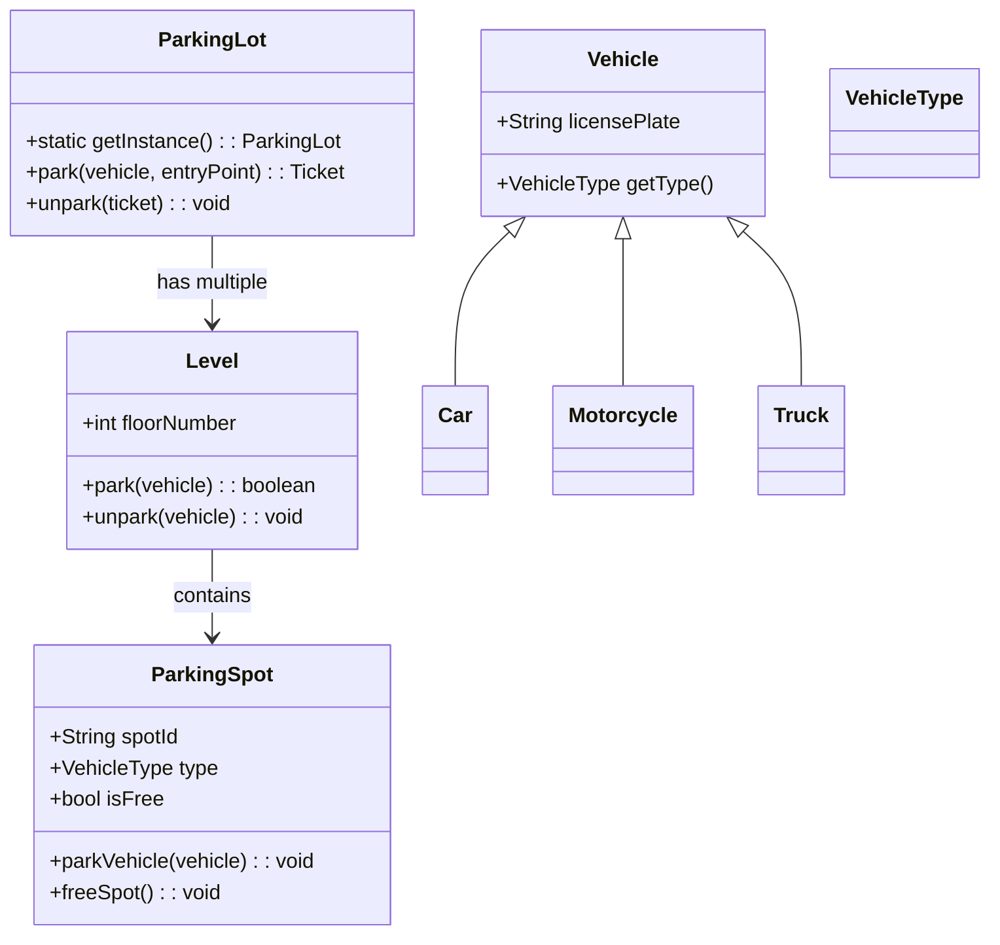
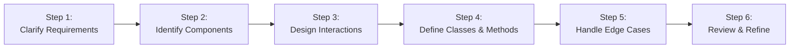
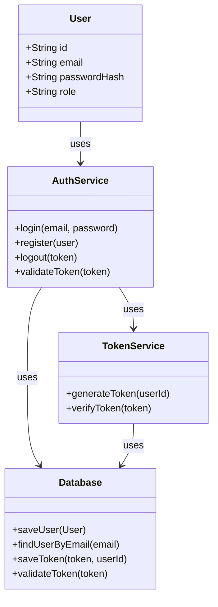
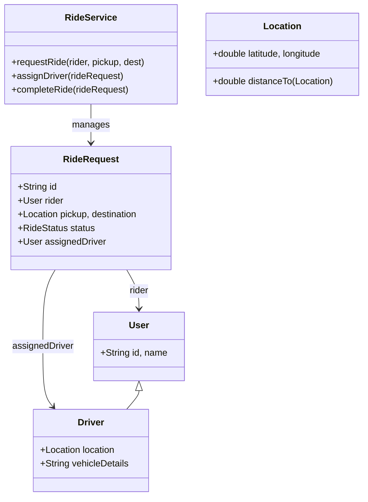
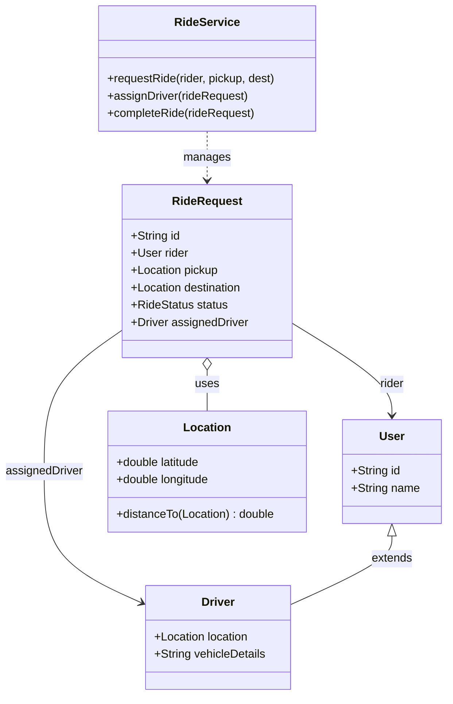

# Low-Level Design (LLD)

## Executive Summary

Low-Level Design (LLD) is the phase of software design where high-level architecture is translated into detailed components: classes, methods, data structures, and algorithms【2†L128-L134】.  It acts as the **blueprint for developers**, specifying exactly *how* each piece of the system will be implemented. LLD emphasizes producing code that is **scalable** (handles growth), **maintainable** (clear and modular), and **reusable** (low coupling, high cohesion)【6†L37-L42】【2†L134-L137】. In essence, LLD bridges the gap between architecture and code【12†L161-L162】: after deciding *what* the system will do (HLD), LLD defines *how* it will do it at the code level (objects, algorithms, and data structures). This guide provides an in-depth look at LLD concepts, examples, and best practices, including sample UML diagrams and multi-language code snippets.

```javascript
console.log("Hello");
```
```typescript
const greeting: string = "Hello";
```
```python
print("Hello")
```

---


## What is Low-Level Design?

Low-Level Design (LLD) is the process of **detailing the implementation** of system components. It takes the high-level modules from the architectural blueprint and expands them into concrete software constructs.  In LLD, we define:

- **Classes & Interfaces**: e.g. `User`, `AuthService`, `ParkingLot`, with their attributes and methods.
- **Data Structures & Algorithms**: choosing appropriate structures (lists, hash maps, graphs) and algorithms (sorting, search, shortest path) for each component.
- **Design Patterns & Principles**: applying OOP patterns (Singleton, Strategy, Observer, etc.) and SOLID principles to organize code【2†L134-L137】【12†L178-L188】.
- **UML Diagrams**: class diagrams, sequence diagrams, state diagrams, etc., that illustrate the detailed design【12†L149-L158】.

LLD is essentially the **detailed blueprints** for developers.  It specifies how modules interact at the code level (method calls, object relationships) and what data structures they use【9†L154-L163】【12†L149-L158】. For example, after an HLD defines “we need a User Service and an Auth Service”, the LLD would spell out the `User` and `AuthService` classes, the database schema, and methods like `login()` and `logout()`【2†L128-L134】【9†L154-L163】. 

In summary, LLD answers **“How will each part of the system be built?”** by providing class interfaces, pseudocode or real code, and algorithms that implement the system’s functionality. It ensures that the code will be **scalable, maintainable, and efficient**【6†L37-L42】【15†L121-L124】.

---


```python
class Stack:
    """A simple stack implementation with encapsulation."""

    def __init__(self):
        self._items = []

    def push(self, item):
        """Add an item to the top of the stack."""
        self._items.append(item)

    def pop(self):
        """Remove and return the top item."""
        if self.is_empty():
            raise IndexError("Pop from empty stack")
        return self._items.pop()

    def peek(self):
        """View the top item without removing it."""
        if self.is_empty():
            raise IndexError("Peek at empty stack")
        return self._items[-1]

    def is_empty(self):
        """Check if the stack is empty."""
        return len(self._items) == 0

    def size(self):
        """Return the number of items in the stack."""
        return len(self._items)


# Usage
stack = Stack()
stack.push(10)
stack.push(20)
print(stack.peek())  # 20
print(stack.pop())   # 20
print(stack.size())  # 1
```
```java
public class Stack<T> {
    private java.util.List<T> items;

    public Stack() {
        this.items = new java.util.ArrayList<>();
    }

    /**
     * Add an item to the top of the stack.
     */
    public void push(T item) {
        items.add(item);
    }

    /**
     * Remove and return the top item.
     */
    public T pop() {
        if (isEmpty()) {
            throw new IllegalStateException("Pop from empty stack");
        }
        return items.remove(items.size() - 1);
    }

    /**
     * View the top item without removing it.
     */
    public T peek() {
        if (isEmpty()) {
            throw new IllegalStateException("Peek at empty stack");
        }
        return items.get(items.size() - 1);
    }

    /**
     * Check if the stack is empty.
     */
    public boolean isEmpty() {
        return items.isEmpty();
    }

    /**
     * Return the number of items in the stack.
     */
    public int size() {
        return items.size();
    }
}

// Usage
Stack<Integer> stack = new Stack<>();
stack.push(10);
stack.push(20);
System.out.println(stack.peek());  // 20
System.out.println(stack.pop());   // 20
System.out.println(stack.size());  // 1
```
```cpp
#include <vector>
#include <stdexcept>

template<typename T>
class Stack {
private:
    std::vector<T> items;

public:
    /**
     * Add an item to the top of the stack.
     */
    void push(const T& item) {
        items.push_back(item);
    }

    /**
     * Remove and return the top item.
     */
    T pop() {
        if (isEmpty()) {
            throw std::out_of_range("Pop from empty stack");
        }
        T top = items.back();
        items.pop_back();
        return top;
    }

    /**
     * View the top item without removing it.
     */
    const T& peek() const {
        if (isEmpty()) {
            throw std::out_of_range("Peek at empty stack");
        }
        return items.back();
    }

    /**
     * Check if the stack is empty.
     */
    bool isEmpty() const {
        return items.empty();
    }

    /**
     * Return the number of items in the stack.
     */
    size_t size() const {
        return items.size();
    }
};

// Usage
Stack<int> stack;
stack.push(10);
stack.push(20);
std::cout << stack.peek() << std::endl;  // 20
std::cout << stack.pop() << std::endl;   // 20
std::cout << stack.size() << std::endl;  // 1
```

## Pillars of LLD

Effective LLD strives for three key qualities:

- **Scalability:** The design should handle increasing load (users, data) gracefully. For example, choosing efficient algorithms and designs that can be parallelized or distributed【6†L37-L42】【11†L30-L34】.
- **Maintainability:** Code should be easy to understand, modify, and extend. Clear class responsibilities, meaningful interfaces, and modular structure (guided by SOLID principles) promote maintainability【6†L37-L42】【12†L178-L188】.
- **Reusability:** Components are designed to be reused in different contexts. This means avoiding tight coupling, using abstract interfaces, and applying design patterns so that one component can serve multiple purposes【6†L37-L42】【2†L134-L137】.

By focusing on these pillars, LLD produces code that can grow and evolve with the system. For example, a well-designed cache component can be reused across services, and a robust user authentication class can be extended for future login methods, all without major rewrites.

---

## What LLD is *Not*

Low-Level Design does **not** concern itself with infrastructure or technology choices. Those decisions belong to **High-Level Design (HLD)**. HLD deals with system-wide concerns such as:
- Choosing frameworks and databases (e.g. SQL vs NoSQL)
- Scalability strategies (load balancers, sharding)
- Servers, cloud infrastructure, and network topology
- Overall module/component layout (microservices vs monolith, for instance)

In contrast, LLD focuses on the **code structure** within those components. While HLD might say “use a relational database,” LLD defines “this table will have these columns and how we access it (e.g., via `UserRepository.getUserById()`).”  As one explanation puts it: **“HLD focuses on overall architecture (tech stack, servers), while LLD delves into the specifics of code structure and object-oriented design”**【6†L55-L59】. 

Thus, if HLD answers *“What technologies and services will we use?”*, LLD answers *“Which classes, methods, and data structures will we write?”*.

---

## HLD vs LLD vs DSA

LLD sits in between *High-Level Design* (HLD) and *Data Structures & Algorithms* (DSA). The table below summarizes their roles:

| Aspect               | High-Level Design (HLD)                | Low-Level Design (LLD)                                | Data Structures & Algorithms (DSA)               |
|----------------------|---------------------------------------|-------------------------------------------------------|--------------------------------------------------|
| **Definition**       | Overall system architecture, major modules and services【9†L140-L148】. | Detailed implementation plan of each component【9†L154-L163】. | Foundational techniques for data organization and problem-solving【11†L30-L34】. |
| **Focus**            | System-wide structure: components, frameworks, databases, integrations. | Component-level code: classes, interfaces, methods, design patterns. | Efficiency: choosing algorithms and data structures for speed and resource use. |
| **When Used**        | At the start of design (architecture planning, system design interviews). | After HLD, during detailed design/implementation or LLD interviews. | Throughout development: in coding interviews, optimization tasks, and any implementation. |
| **Key Elements**     | Block diagrams, API interfaces, DB schema, network layout. | UML diagrams (class, sequence), pseudocode, class definitions. | Arrays, lists, trees, graphs, sorting/searching algorithms, complexity analysis. |
| **Example**          | Designing a ride-sharing app: defining services (User Service, Ride Matching Service, Payment Service) and their interactions. | Designing an Authentication module: classes `User`, `AuthService`, `TokenService` with methods like `login()` and `validateToken()`. | Using a hash map and linked list to build an LRU cache (O(1) get/put) or using Dijkstra’s algorithm for route finding in a map. |
| **Interview Role**   | System-design interviews for architecture thinking. | Object-oriented design questions (LLD interviews). | Algorithm/coding interviews (LeetCode, etc.), performance-critical tasks. |

【32†embed_image】 *Figure: A sample LLD “roadmap” diagram (object principles, design patterns, UML, SOLID) from GeeksforGeeks.*

Another way to visualize the relationship is a flowchart: **HLD → LLD → DSA**. HLD provides the big picture, LLD drills into the components, and DSA ensures each component is efficient. 

```mermaid id="relationship-chart"
flowchart LR
    A[High-Level Design\n(System Architecture)] --> B[Low-Level Design\n(Component Design)]
    B --> C[Data Structures & Algorithms\n(Efficient Implementation)]
```

---

## Steps in LLD Design (Interview Approach)

In an LLD interview or design exercise, it helps to follow a structured approach. One recommended sequence is:

1. **Clarify Requirements:** Ask questions and confirm use-cases and constraints. Make sure you understand what needs to be built【30†L196-L204】.
2. **Identify Core Components:** Break the system into main entities or classes. Determine responsibilities (e.g., `ParkingLot`, `ParkingSpot`, `User`, `AuthService`)【30†L196-L204】.
3. **Design Interactions:** Draw how these components communicate. Use sequence diagrams or flowcharts to model key scenarios (e.g., user login flow, car parking flow)【30†L198-L204】.
4. **Define Classes & Methods:** Specify the classes, their attributes, methods, and relationships. Create UML class diagrams to visualize these details【30†L200-L204】.
5. **Consider Edge Cases and Trade-offs:** Think about invalid inputs, concurrency issues, and how your design handles them. Discuss any design choices (e.g., data structure selection)【30†L205-L208】.
6. **Review & Refine:** Check that your design meets all requirements. Optimize or refactor if needed, and articulate any improvements.

These steps not only organize your design process but also demonstrate clear thinking to interviewers. For example, many recommendations include using **UML diagrams** (class/sequence) to convey your LLD clearly【12†L149-L158】【30†L196-L204】.



---

## Example: User Authentication System

**Scenario:** Design an authentication module for a web or mobile app (register, login, token management).

**LLD Components:** 
- **Classes:**  
  - `User` (holds `id`, `email`, `passwordHash`, `role`, etc.).  
  - `AuthService` (methods like `login(email, password)`, `register(user)`, `logout(token)`, `validateToken(token)`).  
  - `TokenService` (generates and validates JWT or session tokens).  
  - `Database` or `UserRepository` (accesses user records, e.g. `findUserByEmail`, `saveUser`).  
- **Data Structures:**  
  - Passwords stored hashed (e.g. bcrypt hash string).  
  - Tokens with expiry metadata (e.g. a map of active tokens or JWT with signature).  
- **Algorithms:**  
  - Password verification (bcrypt compare) – typically O(1) time.  
  - Token generation (random/cryptographic or JWT signing).  
- **Design Patterns:**  
  - Factory or Strategy could create different `AuthProvider` (e.g. Google OAuth vs local DB auth).  
  - **Singleton** for `AuthService` or `TokenService` if only one instance is needed.  



**Sequence Diagram (Login Flow):** 

```mermaid id="auth-sequence" sequenceDiagram
    User -> AuthService: login(email, password)
    AuthService -> Database: findUserByEmail(email)
    Database --> AuthService: userRecord
    AuthService -> AuthService: verifyPassword(userRecord.passwordHash, password)
    alt password valid
        AuthService -> TokenService: generateToken(userRecord.id)
        TokenService --> AuthService: token
        AuthService --> User: return token
    else password invalid
        AuthService --> User: error("Invalid credentials")
    end
```

**Code Samples:** Below are sketch examples of an `AuthService`. Error handling and security checks are included.

```python
# Python example
class User:
    def __init__(self, id, email, password_hash, role="user"):
        self.id = id
        self.email = email
        self.password_hash = password_hash
        self.role = role

class AuthService:
    def __init__(self, database, token_service):
        self.db = database
        self.tokens = token_service

    def login(self, email, password):
        user = self.db.find_user_by_email(email)
        if not user:
            raise ValueError("User not found")
        if not self.verify_password(password, user.password_hash):
            raise ValueError("Invalid credentials")
        token = self.tokens.generate_token(user.id)
        return token

    def register(self, email, password):
        if self.db.find_user_by_email(email):
            raise ValueError("User already exists")
        hashed = self.hash_password(password)
        new_user = User(self.db.next_id(), email, hashed)
        self.db.save_user(new_user)
        return new_user.id

    def verify_password(self, password, password_hash):
        # (In real code, use bcrypt or similar)
        return hash(password) == password_hash

    def hash_password(self, password):
        return hash(password)

# Usage
# db = SomeDatabase()
# token_service = TokenService()
# auth = AuthService(db, token_service)
# user_id = auth.register("alice@example.com", "secret")
# token = auth.login("alice@example.com", "secret")
```

```cpp
// C++ example
#include <string>
#include <stdexcept>

class User {
public:
    std::string id, email, passwordHash;
    User(std::string id, std::string email, std::string pwdHash)
      : id(id), email(email), passwordHash(pwdHash) {}
};

class AuthService {
    Database& db;
    TokenService& tokens;
public:
    AuthService(Database& db, TokenService& tokens) : db(db), tokens(tokens) {}
    std::string login(const std::string& email, const std::string& password) {
        User user = db.findUserByEmail(email);
        if (user.id.empty()) throw std::runtime_error("User not found");
        if (!verifyPassword(password, user.passwordHash))
            throw std::runtime_error("Invalid credentials");
        return tokens.generateToken(user.id);
    }
    std::string registerUser(const std::string& email, const std::string& password) {
        if (db.findUserByEmail(email).id != "")
            throw std::runtime_error("User exists");
        std::string hashed = hashPassword(password);
        User newUser(db.nextId(), email, hashed);
        db.saveUser(newUser);
        return newUser.id;
    }
private:
    bool verifyPassword(const std::string& pwd, const std::string& hash) {
        return hashPassword(pwd) == hash;
    }
    std::string hashPassword(const std::string& pwd) {
        // Use a real hash function in production!
        return std::to_string(std::hash<std::string>{}(pwd));
    }
};
```

```java
// Java example
public class User {
    public String id, email, passwordHash;
    public User(String id, String email, String pwdHash) {
        this.id = id; this.email = email; this.passwordHash = pwdHash;
    }
}

public class AuthService {
    private Database db;
    private TokenService tokens;
    public AuthService(Database db, TokenService tokens) {
        this.db = db; this.tokens = tokens;
    }
    public String login(String email, String password) {
        User user = db.findUserByEmail(email);
        if (user == null) throw new IllegalArgumentException("User not found");
        if (!verifyPassword(password, user.passwordHash))
            throw new IllegalArgumentException("Invalid credentials");
        return tokens.generateToken(user.id);
    }
    public String registerUser(String email, String password) {
        if (db.findUserByEmail(email) != null)
            throw new IllegalArgumentException("User exists");
        String hashed = hashPassword(password);
        User user = new User(db.nextId(), email, hashed);
        db.saveUser(user);
        return user.id;
    }
    private boolean verifyPassword(String pwd, String hash) {
        // (Use real hashing like BCrypt in production)
        return hashPassword(pwd).equals(hash);
    }
    private String hashPassword(String pwd) {
        return Integer.toString(pwd.hashCode());
    }
}
```

In all cases, **error handling** is important: the code checks for missing users, invalid passwords, duplicate registrations, etc.  These checks are critical LLD details. The `AuthService` design ensures that unauthorized access is rejected and that tokens are only issued to valid users.

---

## Example: Ride-Sharing Platform (Simplified)

**Scenario:** Design the low-level components of a ride-hailing system (like Uber).

**LLD Components:** 
- **Classes:**  
  - `User` (id, name, etc.) – can be a rider or driver (use inheritance or role flag).  
  - `Driver` extends `User` (current location, vehicle details, status).  
  - `RideRequest` (rider, pickup, destination, status, assignedDriver).  
  - `RideService` (methods like `requestRide(user, pickup, destination)`, `assignDriver(request)`, `completeRide(request)`).  
  - `Location` (latitude, longitude, distance calculations).  
- **Data Structures:**  
  - A priority queue or sorted set of nearby drivers (by distance) for matching.  
  - Hash maps to index drivers by availability and location cells (for fast lookup).  
- **Algorithms:**  
  - Nearest-driver search (could use k-d tree or geohash buckets) – complexity depends on approach (often O(log n) for spatial index).  
  - Route finding (Dijkstra/A* on a graph) – O(E + V log V) for shortest path.  
- **Design Patterns:**  
  - **Strategy:** different matching strategies (e.g. nearest vs cheapest).  
  - **Observer:** riders can subscribe to status updates on their ride.  
  - **Factory:** create different vehicle types (Car, Bike) dynamically.  



In a ride-sharing LLD, the **interaction flow** might be: a rider calls `requestRide()`, the system finds the nearest available drivers, notifies one (via Observer or callback), and assigns them to the `RideRequest`. The driver’s status is updated to busy. After ride completion, `completeRide()` updates statuses and records the trip.

(For brevity, full code is omitted. The design would follow similar OOP structure as above examples.)

---

## Example: Caching System (LRU Cache)

**Scenario:** Implement an **LRU (Least Recently Used) Cache** with O(1) `get(key)` and `put(key, value)` operations.

**LLD Components:** 
- **Classes/Structures:**  
  - `Node` (doubly-linked list node containing `key, value, prev, next`).  
  - `LRUCache` (maintains a fixed-size cache, uses a hash map from key to `Node`, and a doubly-linked list of recent usage).  
- **Data Structures:**  
  - **Hash Map:** maps keys to nodes for O(1) access.  
  - **Doubly Linked List:** maintains usage order (head = most recent, tail = least recent).  
- **Design Patterns:**  
  - Not a classic “GoF” pattern, but this design is standard for LRU.  
- **Performance:**  
  - Both `get` and `put` operations run in **O(1)** time by combining the map and list【18†L292-L300】.  
  - When a key is accessed via `get`, its node is moved to the head. On `put`, if the cache is full, remove the tail node (the LRU item) and insert the new node at the head.

【18†L292-L300】 gives a summary: “The `LRUCache` class implements the LRU functionality using a hash map (cache) and a doubly-linked list (head and tail). The `get` method retrieves a value and moves the node to the head, while `put` inserts or updates a node, removing the tail if at capacity.” This achieves constant-time operations.

**Code Samples:** A simplified LRU cache in each language:

```python
# Python example (using OrderedDict for brevity)
from collections import OrderedDict

class LRUCache:
    def __init__(self, capacity):
        self.cache = OrderedDict()
        self.capacity = capacity

    def get(self, key):
        if key not in self.cache:
            return -1
        # Move key to end (mark as most recently used)
        self.cache.move_to_end(key)
        return self.cache[key]

    def put(self, key, value):
        if key in self.cache:
            self.cache.move_to_end(key)
        self.cache[key] = value
        if len(self.cache) > self.capacity:
            # popitem(last=False) pops least recently used (first item)
            self.cache.popitem(last=False)
```

```cpp
// C++ example (using list and unordered_map)
#include <list>
#include <unordered_map>
using namespace std;

class LRUCache {
    int cap;
    list<pair<int,int>> dll; // front = most recent
    unordered_map<int, list<pair<int,int>>::iterator> mp;
public:
    LRUCache(int capacity): cap(capacity) {}

    int get(int key) {
        auto it = mp.find(key);
        if (it == mp.end()) return -1;
        // Move the accessed node to front
        dll.splice(dll.begin(), dll, it->second);
        return it->second->second;
    }
    void put(int key, int value) {
        auto it = mp.find(key);
        if (it != mp.end()) {
            // Update and move to front
            it->second->second = value;
            dll.splice(dll.begin(), dll, it->second);
            return;
        }
        if (dll.size() == cap) {
            // Remove LRU item
            auto lru = dll.back();
            mp.erase(lru.first);
            dll.pop_back();
        }
        dll.emplace_front(key, value);
        mp[key] = dll.begin();
    }
};
```

```java
// Java example (using LinkedHashMap for brevity)
import java.util.LinkedHashMap;
import java.util.Map;

public class LRUCache extends LinkedHashMap<Integer,Integer> {
    private int capacity;
    public LRUCache(int capacity) {
        super(capacity, 0.75f, true);
        this.capacity = capacity;
    }
    @Override
    protected boolean removeEldestEntry(Map.Entry<Integer,Integer> eldest) {
        return size() > capacity;
    }
    public int get(int key) {
        return super.getOrDefault(key, -1);
    }
    public void put(int key, int value) {
        super.put(key, value);
    }
}
```

These implementations demonstrate how LLD translates to code: classes (`LRUCache`, helper `Node` or using library structures), clear methods (`get`, `put`), and ensuring **thread-safety** or performance only if needed (the GitHub design notes mention using locks for concurrency and `synchronized` methods for thread-safety【18†L304-L307】, but simple versions omit those details for clarity). The key takeaway is how choice of data structures (hash map + linked list) achieves the design goals.

---

【21†embed_image】 *Figure: Example of a parking lot with different vehicle types and a handicap spot (illustrative only).*

## Example: Parking Lot System

**Scenario:** Design a multi-level parking lot system with various spot types (car, motorcycle, truck).

**LLD Components:** 
- **Classes:**  
  - `ParkingLot` (Singleton): manages levels, `park(vehicle)`, `unpark(ticket)`.  
  - `Level`: represents one floor with many spots.  
  - `ParkingSpot`: has `spotId`, `type` (vehicle type it fits), `isFree` flag, and methods to `parkVehicle()` or `freeSpot()`.  
  - `Vehicle` (abstract): common properties (e.g. `licensePlate`); subclasses `Car`, `Motorcycle`, `Truck`.  
  - `VehicleType` (enum): e.g. `CAR, MOTORCYCLE, TRUCK`.  
  - `Ticket`: (records vehicle, spot, entry time).  
- **Data Structures:**  
  - An array or list of parking spots per level (e.g. a 2D grid)【13†L72-L74】.  
  - Maps to track free spots by type for quick lookup.  
- **Design Patterns:**  
  - **Singleton:** ensure one `ParkingLot` instance【20†L112-L118】.  
  - **Factory (Optional):** create vehicle objects from input strings.  
  - **Strategy (Optional):** different spot assignment strategies (e.g. first-fit vs nearest).  
  - **Observer (Optional):** customers can subscribe to availability updates (mentioned by some designs).
- **Concurrency:** Multiple entry/exit points may act concurrently, so methods like `park()`/`unpark()` should use locks or synchronized blocks for thread safety【20†L104-L108】.




In this design:
- A `ParkingLot` singleton contains multiple `Level` objects (one per floor)【20†L75-L83】.
- Each `Level` has a collection (e.g. 2D array) of `ParkingSpot`s【13†L72-L74】.
- `ParkingSpot` tracks its `VehicleType` (who can park there) and whether it’s free【20†L87-L90】.
- When a vehicle arrives, `ParkingLot.park()` finds an appropriate free spot (e.g. first match) and marks it occupied, returning a `Ticket`.
- `ParkingLot.unpark()` frees the spot using the ticket information.

Design patterns used include the **Singleton** for `ParkingLot` (so only one global lot exists)【20†L112-L118】, and possibly **Factory** for vehicle creation and **Observer** if clients get real-time updates. The system must handle concurrent parking/unparking; in Java one might use `synchronized` on methods, in Python a `threading.Lock`, or in C++ `std::mutex` to prevent race conditions【20†L104-L108】.

```python
# Python example (simplified)
from threading import Lock

class ParkingLot:
    _instance = None
    _lock = Lock()  # for thread safety
    def __new__(cls, levels=5, spotsPerLevel=50):
        with cls._lock:
            if cls._instance is None:
                cls._instance = super(ParkingLot, cls).__new__(cls)
                # Initialize only once
                cls._instance.levels = [Level(i, spotsPerLevel) for i in range(levels)]
            return cls._instance

    def park(self, vehicle):
        for level in self.levels:
            if level.park(vehicle):
                return True
        return False

    def unpark(self, vehicle):
        for level in self.levels:
            if level.unpark(vehicle):
                return True
        return False

class Level:
    def __init__(self, number, numSpots):
        self.floorNumber = number
        self.spots = [ParkingSpot(f"{number}-{i}", "CAR") for i in range(numSpots)]
        self.lock = Lock()

    def park(self, vehicle):
        with self.lock:
            for spot in self.spots:
                if spot.isFree and spot.type == vehicle.getType():
                    spot.parkVehicle(vehicle)
                    return True
        return False

    def unpark(self, vehicle):
        with self.lock:
            for spot in self.spots:
                if not spot.isFree and spot.parkedVehicle == vehicle:
                    spot.freeSpot()
                    return True
        return False

class ParkingSpot:
    def __init__(self, id, vehicleType):
        self.spotId = id
        self.type = vehicleType
        self.isFree = True
        self.parkedVehicle = None
    def parkVehicle(self, vehicle):
        self.isFree = False
        self.parkedVehicle = vehicle
    def freeSpot(self):
        self.isFree = True
        self.parkedVehicle = None

class Car:
    def __init__(self, plate):
        self.licensePlate = plate
    def getType(self):
        return "CAR"

# Usage
lot = ParkingLot(levels=2, spotsPerLevel=10)
car = Car("ABC-123")
lot.park(car)   # Attempts to park the car
lot.unpark(car) # Frees the spot
```

```cpp
// C++ example (outline)
class ParkingSpot {
  string spotId;
  string type;
  bool isFree;
  Vehicle* parkedVehicle;
public:
  void parkVehicle(Vehicle* v) { isFree=false; parkedVehicle=v; }
  void freeSpot() { isFree=true; parkedVehicle=nullptr; }
};

class Level {
  int floorNumber;
  vector<ParkingSpot> spots;
  mutex mtx;
public:
  Level(int num) : floorNumber(num), spots(/*init spots*/) {}
  bool park(Vehicle* v) {
    lock_guard<mutex> lock(mtx);
    for (auto &spot : spots) {
      if (spot.isFree && spot.type == v->getType()) {
        spot.parkVehicle(v);
        return true;
      }
    }
    return false;
  }
  bool unpark(Vehicle* v) {
    lock_guard<mutex> lock(mtx);
    for (auto &spot : spots) {
      if (!spot.isFree && spot.parkedVehicle == v) {
        spot.freeSpot();
        return true;
      }
    }
    return false;
  }
};

class ParkingLot {
  vector<Level> levels;
  static ParkingLot* instance;
  ParkingLot() { /* init levels */ }
public:
  static ParkingLot* getInstance() {
    if (!instance) instance = new ParkingLot();
    return instance;
  }
  bool park(Vehicle* v) {
    for (auto &lvl : levels) if (lvl.park(v)) return true;
    return false;
  }
  bool unpark(Vehicle* v) {
    for (auto &lvl : levels) if (lvl.unpark(v)) return true;
    return false;
  }
};
```

```java
// Java example (outline)
public class ParkingLot {
    private static ParkingLot instance = null;
    private List<Level> levels;
    private ParkingLot(int numLevels, int spotsPerLevel) { /* initialize levels */ }
    public static synchronized ParkingLot getInstance(int numLevels, int spots) {
        if (instance == null) instance = new ParkingLot(numLevels, spots);
        return instance;
    }
    public boolean park(Vehicle v) {
        for (Level lvl : levels) {
            if (lvl.park(v)) return true;
        }
        return false;
    }
    public boolean unpark(Vehicle v) {
        for (Level lvl : levels) {
            if (lvl.unpark(v)) return true;
        }
        return false;
    }
}

public abstract class Vehicle {
    private String licensePlate;
    public abstract String getType();
}
public class Car extends Vehicle {
    public String getType() { return "CAR"; }
}
```

These examples illustrate the class structure and critical sections (synchronized/locked) for concurrency. The design uses the **Singleton** pattern for `ParkingLot` to ensure one global lot【20†L112-L118】, and each `Level` is responsible for its parking logic. The linked concepts (levels, spots, vehicles) mirror the high-level requirements while giving precise implementation details.

---

## Performance & Complexity

In LLD, we also consider **performance trade-offs**:

- **Time Complexity:** Choose algorithms that meet non-functional requirements. For example, the LRU cache design yields O(1) for `get/put`【18†L292-L300】. In a ride-sharing system, the driver-matching algorithm might be O(log N) or O(N) depending on spatial indexing (priority queues, maps).  
- **Space Complexity:** Ensure data structures fit the scale. For instance, storing a doubly-linked list and map in LRU cache incurs O(capacity) memory.  
- **Concurrency:** LLD must address thread-safety and locking. As shown above, parking and LRU examples synchronize access to shared data to avoid corruption.  
- **Scalability:** Some choices (like LinkedHashMap in Java for LRU or using a distributed cache) can improve scaling. 

In each example, the DSA choices are integral. For instance, **LRU Cache uses a hash map + list for efficiency**【18†L292-L300】; **ride-sharing might use a graph search (e.g. Dijkstra)** for routing; **parking lot might use fixed-size arrays or grids** for O(1) spot lookup. The LLD should articulate these decisions clearly.

---

## Interview Tips and Common LLD Questions

In interviews, LLD questions often involve designing modules for real systems. Common topics include:
- **Designing real-world systems:** Parking Lot, Elevator System, Text Editor, Movie Ticket Booking, Cache (LRU/LFU), File Storage, Coffee Machine, etc.【13†L60-L68】【13†L75-L84】.
- **Design Patterns:** Be prepared to identify and apply patterns (Singleton for single-instance, Factory for object creation, Strategy for flexible behavior, Observer for pub/sub). For example, an LLD answer might explicitly say “we use Singleton for ParkingLot to ensure only one instance”【20†L112-L118】.
- **OOP Principles:** Emphasize encapsulation, inheritance, polymorphism. E.g., using an abstract `Vehicle` class in parking to handle `Car`, `Bike`【20†L93-L100】.
- **Drawing Diagrams:** Always sketch class and sequence diagrams while explaining your answer; visuals help convey structure and flow【12†L149-L158】【30†L200-L204】.
- **Communication:** Speak your thought process. Interviewers value clarity (for instance, following the step-wise approach above).

According to preparation guides, **interviewers expect**: clear breakdown of components, justification of chosen data structures/algorithms, and awareness of edge cases (e.g. what happens if the cache is empty, or a parking lot is full)【30†L196-L204】【30†L205-L208】. Practice questions from sources like GeeksforGeeks, LeetCode Discuss, or system design mock interviews can help solidify these skills.

---

## Learning Resources

To master LLD, focus on:

- **OOP & SOLID Principles:** Strong understanding of classes, inheritance, interfaces, and design principles【12†L178-L188】.
- **Design Patterns:** Classic books like *“Design Patterns”* by Gamma et al. (GoF)【30†L212-L220】, *“Head First Design Patterns”* (Freeman & Robson)【30†L212-L220】.
- **Code Quality:** *“Clean Code”* by Robert C. Martin【30†L212-L220】 emphasizes readable, maintainable code.
- **Advanced System Design:** *“Designing Data-Intensive Applications”* by Kleppmann【30†L221-L224】, and *“Patterns of Enterprise Application Architecture”* (Fowler)【30†L221-L224】 for scalable architectures.
- **Online Courses and Guides:** Reputable blogs (GeeksforGeeks, Medium’s LLD series), GitHub interview prep repos, and tech talks (e.g. ByteByteGo, System Design Primer) with UML examples.
- **Practice:** Implement LLD exercises (Parking Lot, Cache, Booking system, etc.) in multiple languages. Draw UML diagrams and time yourself to simulate interview conditions.

Each of these resources will deepen your understanding of how to structure and explain LLD. For example, GeeksforGeeks provides tailored LLD interview preparation tips and step-by-step guidelines【12†L149-L158】【30†L196-L204】.

---

**Summary:** Low-Level Design is the art of detailing each part of the system with concrete classes, data structures, and algorithms. It ensures that the high-level architecture is implemented correctly, efficiently, and in a maintainable way【9†L154-L163】【6†L37-L42】. By mastering LLD, engineers bridge the gap between abstract design and working software, which is critical for building robust, scalable applications.